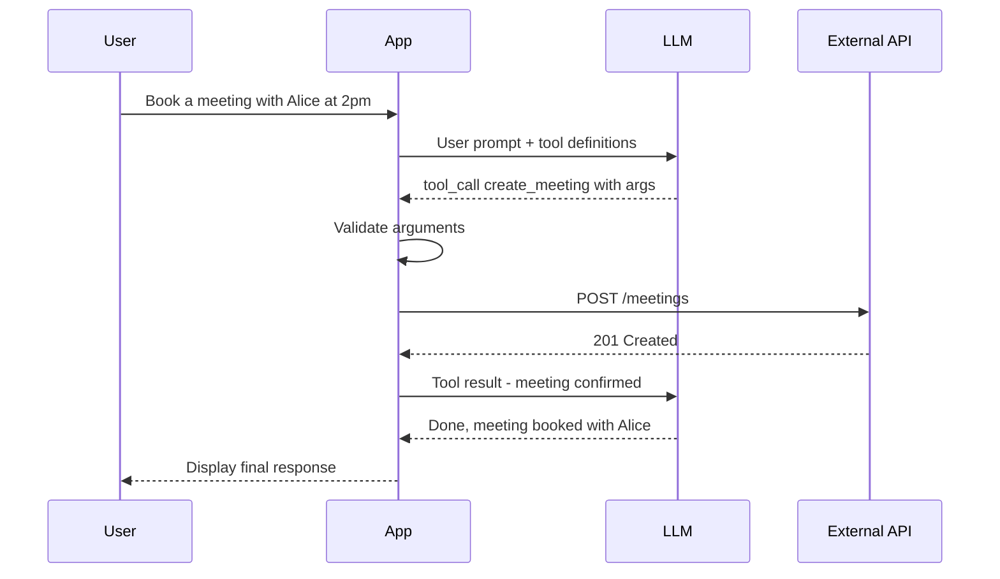

## In a nutshell

When you use ChatGPT, Claude, or another AI assistant, and it books a meeting, checks the weather, or queries a database — it's not typing into a browser. It's using **function calling**: a mechanism where the AI model receives a menu of available tools (described in JSON), picks the right one, fills in the arguments, and your code executes the actual API call. The model never touches your API directly — it just says "call this function with these parameters" and trusts your code to do the rest.

This is a rapidly evolving space. The patterns described here represent current best practices as of early 2026, but formats, standards, and capabilities are changing fast. Treat this section as a snapshot of where things stand — not a settled standard.

## The situation

You have a well-designed REST API. Great docs, clean resource modeling, proper error handling. A developer wants to let an LLM agent book meetings through your API. They wire it up, and the model starts hallucinating endpoints, sending malformed dates, and calling `DELETE` when it meant `GET`.

The API isn't broken. But it was designed for humans who read docs — not for models that need structured tool definitions.

## How it works: the 3-step loop

The function calling loop is simple:

1. **You describe your tools** — send JSON definitions of available functions alongside the user's prompt
2. **The model picks a tool** — instead of generating text, it returns a structured function call with arguments
3. **Your code executes it** — you run the actual API call, then feed the result back to the model for a final response

LLMs don't make HTTP requests directly. Instead, you provide **tool definitions** — structured JSON descriptions of what functions are available. The model reads these definitions, decides which function to call, and returns a structured request. Your code executes the actual call and feeds the result back.

Here's the flow at a glance:



Here's the full loop with OpenAI's tool use format:

### Step 1: Define the tools

You send available tools alongside your prompt:

```json
{
  "model": "gpt-4o",
  "messages": [
    { "role": "user", "content": "Book a meeting with Alice tomorrow at 2pm" }
  ],
  "tools": [
    {
      "type": "function",
      "function": {
        "name": "create_meeting",
        "description": "Schedule a new meeting with one or more participants. Use ISO 8601 datetime format. Duration is in minutes.",
        "parameters": {
          "type": "object",
          "properties": {
            "title": {
              "type": "string",
              "description": "Short title for the calendar event"
            },
            "start_time": {
              "type": "string",
              "format": "date-time",
              "description": "Meeting start time in ISO 8601 format, e.g. 2026-04-14T14:00:00Z"
            },
            "duration_minutes": {
              "type": "integer",
              "enum": [15, 30, 45, 60, 90],
              "description": "Meeting length in minutes"
            },
            "participants": {
              "type": "array",
              "items": { "type": "string" },
              "description": "List of participant email addresses"
            }
          },
          "required": ["title", "start_time", "duration_minutes", "participants"]
        }
      }
    }
  ]
}
```

### Step 2: The model responds with a function call

The model doesn't answer in natural language. It returns a structured tool call:

```json
{
  "choices": [
    {
      "message": {
        "role": "assistant",
        "tool_calls": [
          {
            "id": "call_abc123",
            "type": "function",
            "function": {
              "name": "create_meeting",
              "arguments": "{\"title\":\"Meeting with Alice\",\"start_time\":\"2026-04-14T14:00:00Z\",\"duration_minutes\":30,\"participants\":[\"alice@example.com\"]}"
            }
          }
        ]
      }
    }
  ]
}
```

Notice: `arguments` is a JSON string, not a parsed object. Your code must parse and validate it before executing.

### Step 3: Execute and feed the result back

You call your actual API, then return the result to the model so it can formulate a response:

```json
{
  "model": "gpt-4o",
  "messages": [
    { "role": "user", "content": "Book a meeting with Alice tomorrow at 2pm" },
    {
      "role": "assistant",
      "tool_calls": [
        {
          "id": "call_abc123",
          "type": "function",
          "function": {
            "name": "create_meeting",
            "arguments": "{\"title\":\"Meeting with Alice\",\"start_time\":\"2026-04-14T14:00:00Z\",\"duration_minutes\":30,\"participants\":[\"alice@example.com\"]}"
          }
        }
      ]
    },
    {
      "role": "tool",
      "tool_call_id": "call_abc123",
      "content": "{\"meeting_id\":\"mtg_9f2a\",\"status\":\"confirmed\",\"calendar_link\":\"https://cal.example.com/mtg_9f2a\"}"
    }
  ]
}
```

The model then generates: *"Done — I've booked a 30-minute meeting with Alice tomorrow at 2:00 PM. Here's the calendar link: ..."*

<Callout type="aha" title="The key shift">
  <p>With function calling, your API's consumer isn't a developer reading docs. It's a language model reading a JSON schema. The quality of your tool definitions — names, descriptions, types, constraints — directly determines whether the model calls the right function with valid arguments.</p>
</Callout>

## What makes a tool definition good

The model has no access to your API docs, your README, or your Swagger UI. It only sees the tool definition. That definition needs to do the work that your entire documentation would do for a human.

| Weak definition | Strong definition | Why it matters |
|---|---|---|
| `"description": "Create meeting"` | `"description": "Schedule a new meeting with one or more participants. Use ISO 8601 datetime format. Duration is in minutes."` | The model needs format hints — it can't click "see examples" |
| `"type": "string"` for duration | `"type": "integer", "enum": [15, 30, 45, 60, 90]` | Constraining values prevents the model from sending `"duration": "half an hour"` |
| No description on parameters | `"description": "Meeting start time in ISO 8601 format, e.g. 2026-04-14T14:00:00Z"` | An example in the description dramatically reduces format errors |
| Everything optional | Explicit `"required"` array | Models skip optional fields aggressively — mark what you actually need |

### The naming problem

Function names matter more than you think. The model uses the name to decide **when** to call a function, not just how.

```json
{
  "name": "handle_request",
  "description": "Process a calendar operation"
}
```

vs.

```json
{
  "name": "create_meeting",
  "description": "Schedule a new meeting with one or more participants"
}
```

The first definition is so vague that the model might call it for anything remotely calendar-related. The second is unambiguous. Name functions like you'd name a CLI command — specific verb, clear noun.

## Human docs vs machine tool definitions

Your API documentation and your tool definitions serve different audiences with different needs:

| Aspect | Human-friendly docs | Machine-friendly tool definition |
|---|---|---|
| **Format** | Markdown, HTML, interactive examples | JSON Schema with descriptions |
| **Examples** | curl commands, code snippets, screenshots | Inline in `description` fields as text |
| **Context** | "See the authentication section" | Must be self-contained — no links |
| **Error guidance** | "If you get a 409, the slot is taken" | Must be in the tool description or handled in result parsing |
| **Discovery** | Browse sidebar, search | Model sees all tools at once in the system prompt |
| **Ambiguity** | Humans ask clarifying questions | Models guess — and guess wrong |

<Callout type="tip" title="Write for both audiences">
  <p>If you maintain a public API, generate your tool definitions from your OpenAPI spec. This keeps human docs and machine definitions in sync. Tools like <code>openapi-to-functions</code> automate this conversion. But always review the output — auto-generated descriptions are often too terse for reliable model use.</p>
</Callout>

## Across providers

The concept is identical across OpenAI, Anthropic, Google, and others — but the wire format differs:

```json
// OpenAI: "tools" array with "function" wrapper
{ "type": "function", "function": { "name": "...", "parameters": { ... } } }

// Anthropic: "tools" array, flatter structure
{ "name": "...", "description": "...", "input_schema": { ... } }

// Google Gemini: "function_declarations" inside "tools"
{ "tools": [{ "function_declarations": [{ "name": "...", "parameters": { ... } }] }] }
```

The schema language is always JSON Schema (or a subset of it). The wrapping differs. If you're building tools that need to work across providers, define your canonical tool schema once and transform it per provider.

<Callout type="warning" title="Validate everything">
  <p>Models do not always produce valid JSON. They sometimes omit required fields, use wrong types, or invent parameter names that don't exist in your schema. Always validate tool call arguments against your schema before executing. Treat LLM output like untrusted user input — because that's exactly what it is.</p>
</Callout>

## Checklist: shipping your first tool definition

- [ ] Is every function name a specific verb + noun? (`create_meeting`, not `handle`)
- [ ] Does every parameter have a `description` with format hints or examples?
- [ ] Are value constraints expressed as `enum`, `minimum`, `maximum`, or `pattern`?
- [ ] Is the `required` array accurate — not too greedy, not too loose?
- [ ] Is the tool description self-contained — no "see docs" references?
- [ ] Are you validating the model's arguments before execution?

---

*Next up: MCP — the emerging standard that aims to make tool definitions portable across models and providers.*
