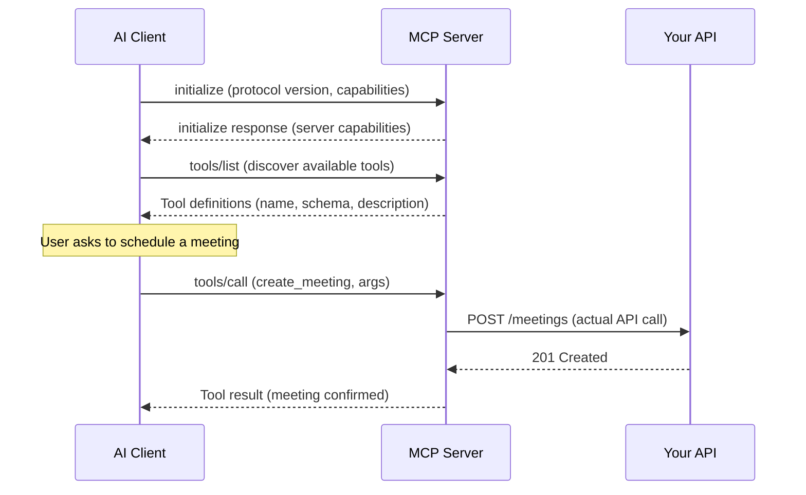

## In a nutshell

MCP (Model Context Protocol) is an attempt to create a universal standard for connecting AI models to external tools and data — the same way USB-C standardized how devices connect to chargers and peripherals. Instead of writing separate tool definitions for OpenAI, Claude, Gemini, and every other AI provider, you write one MCP server and any compatible client can discover and use your tools automatically.

MCP is still in its early days. Adoption is growing but not universal. The protocol is evolving, and the ecosystem of tools and libraries is young. Consider this section a guide to where things are heading — the concepts are solid even as the specifics may shift.

## The situation

Your team has built tool definitions for your calendar API. They work with OpenAI. Then a customer wants to use Claude. Different format. Then Gemini. Another format. Then an open-source model via Ollama. Yet another format. You're now maintaining four versions of the same tool definitions, and every time you add a parameter, you update four files.

This is the problem MCP solves.

## What MCP is

Model Context Protocol is an open standard (created by Anthropic, adopted across the ecosystem) that defines how AI models discover and interact with external tools. Instead of each provider having its own function calling format, MCP provides a single protocol — based on JSON-RPC 2.0 — that any model or client can speak.

Think of it this way:

- **Without MCP:** Each AI provider has its own tool format. You build adapters per provider.
- **With MCP:** You build one MCP server. Any MCP-compatible client can discover and call your tools.

## The protocol flow

MCP follows a clean lifecycle: initialize, discover, call, respond. Here's the full flow at a glance:



### 1. Initialize the connection

The client (an AI application like Claude Desktop, an IDE plugin, or a custom agent) connects to your MCP server and negotiates capabilities:

```json
// Client → Server
{
  "jsonrpc": "2.0",
  "id": 1,
  "method": "initialize",
  "params": {
    "protocolVersion": "2025-03-26",
    "capabilities": { "tools": {} },
    "clientInfo": {
      "name": "claude-desktop",
      "version": "1.4.0"
    }
  }
}
```

```json
// Server → Client
{
  "jsonrpc": "2.0",
  "id": 1,
  "result": {
    "protocolVersion": "2025-03-26",
    "capabilities": {
      "tools": { "listChanged": true }
    },
    "serverInfo": {
      "name": "calendar-mcp-server",
      "version": "0.3.1"
    }
  }
}
```

### 2. Discover available tools

The client asks what tools the server offers:

```json
// Client → Server
{
  "jsonrpc": "2.0",
  "id": 2,
  "method": "tools/list",
  "params": {}
}
```

```json
// Server → Client
{
  "jsonrpc": "2.0",
  "id": 2,
  "result": {
    "tools": [
      {
        "name": "create_meeting",
        "description": "Schedule a new meeting. Requires at least one participant email and an ISO 8601 start time. Duration is in minutes. Returns the confirmed meeting details with a calendar link.",
        "inputSchema": {
          "type": "object",
          "properties": {
            "title": {
              "type": "string",
              "description": "Short title for the calendar event"
            },
            "start_time": {
              "type": "string",
              "format": "date-time",
              "description": "Meeting start in ISO 8601, e.g. 2026-04-14T14:00:00Z"
            },
            "duration_minutes": {
              "type": "integer",
              "enum": [15, 30, 45, 60, 90],
              "description": "Meeting length in minutes"
            },
            "participants": {
              "type": "array",
              "items": { "type": "string", "format": "email" },
              "description": "Participant email addresses"
            }
          },
          "required": ["title", "start_time", "duration_minutes", "participants"]
        }
      },
      {
        "name": "list_meetings",
        "description": "List meetings for a given date range. Returns an array of meeting objects sorted by start time.",
        "inputSchema": {
          "type": "object",
          "properties": {
            "start_date": {
              "type": "string",
              "format": "date",
              "description": "Start of range (inclusive), e.g. 2026-04-14"
            },
            "end_date": {
              "type": "string",
              "format": "date",
              "description": "End of range (inclusive), e.g. 2026-04-18"
            }
          },
          "required": ["start_date", "end_date"]
        }
      }
    ]
  }
}
```

The model now knows exactly what tools exist, what arguments they take, and what they do — without any provider-specific wrapping.

### 3. Call a tool

When the model decides to use a tool, the client sends a `tools/call` request:

```json
// Client → Server
{
  "jsonrpc": "2.0",
  "id": 3,
  "method": "tools/call",
  "params": {
    "name": "create_meeting",
    "arguments": {
      "title": "Meeting with Alice",
      "start_time": "2026-04-14T14:00:00Z",
      "duration_minutes": 30,
      "participants": ["alice@example.com"]
    }
  }
}
```

### 4. Return the result

```json
// Server → Client
{
  "jsonrpc": "2.0",
  "id": 3,
  "result": {
    "content": [
      {
        "type": "text",
        "text": "{\"meeting_id\":\"mtg_9f2a\",\"status\":\"confirmed\",\"title\":\"Meeting with Alice\",\"start_time\":\"2026-04-14T14:00:00Z\",\"duration_minutes\":30,\"calendar_link\":\"https://cal.example.com/mtg_9f2a\"}"
      }
    ]
  }
}
```

The model receives the result and generates a natural-language response for the user. The entire exchange uses the same protocol regardless of whether the client is Claude, ChatGPT, a VS Code extension, or a custom agent.

<Callout type="aha" title="The USB-C analogy">
  <p>Before USB-C, every phone had a different charger. MCP does for AI-tool integration what USB-C did for charging: one standard interface, many implementations. Build your MCP server once, and any compatible client can use your tools.</p>
</Callout>

## MCP beyond tools

MCP isn't just about function calling. The protocol defines three core primitives:

| Primitive | Purpose | Example |
|---|---|---|
| **Tools** | Actions the model can execute | `create_meeting`, `send_email`, `query_database` |
| **Resources** | Data the model can read | Files, database records, API responses — exposed as URIs |
| **Prompts** | Reusable prompt templates | Pre-built workflows like "summarize this PR" or "draft a status update" |

Resources let you expose data without forcing the model to call a function. For example, a `git://repo/main/README.md` resource gives the model access to file content directly. Prompts let server authors package common workflows that users can invoke by name.

## Comparing the approaches

| Aspect | OpenAI function calling | Anthropic tool use | MCP |
|---|---|---|---|
| **Wire format** | Proprietary JSON | Proprietary JSON | JSON-RPC 2.0 (open standard) |
| **Discovery** | Defined in each API request | Defined in each API request | Dynamic — `tools/list` at runtime |
| **Schema language** | JSON Schema subset | JSON Schema | JSON Schema |
| **Transport** | HTTPS (provider API) | HTTPS (provider API) | stdio, HTTP+SSE, Streamable HTTP |
| **Who runs it** | Your code, called by provider | Your code, called by provider | Standalone server, any client connects |
| **Multi-provider** | OpenAI only | Anthropic only | Any MCP-compatible client |
| **Dynamic tools** | No — tools fixed per request | No — tools fixed per request | Yes — `listChanged` notifications |
| **Beyond tools** | No | No | Resources, prompts, sampling |

<Callout type="tip" title="They're not mutually exclusive">
  <p>MCP doesn't replace provider-specific function calling — it sits alongside it. If you're building a tool that only targets one provider, function calling is simpler. If you need to support multiple AI clients or want dynamic tool discovery, MCP is the better investment.</p>
</Callout>

## Building an MCP server

The TypeScript SDK makes this straightforward. Here's a minimal MCP server exposing one tool:

```typescript
import { McpServer } from "@modelcontextprotocol/sdk/server/mcp.js";
import { StdioServerTransport } from "@modelcontextprotocol/sdk/server/stdio.js";
import { z } from "zod";

const server = new McpServer({
  name: "calendar-mcp-server",
  version: "0.3.1",
});

server.tool(
  "create_meeting",
  "Schedule a new meeting. Requires participant emails and an ISO 8601 start time.",
  {
    title: z.string().describe("Short title for the calendar event"),
    start_time: z.string().datetime().describe("Start time in ISO 8601"),
    duration_minutes: z.union([z.literal(15), z.literal(30), z.literal(45), z.literal(60), z.literal(90)])
      .describe("Meeting length in minutes"),
    participants: z.array(z.string().email())
      .describe("Participant email addresses"),
  },
  async ({ title, start_time, duration_minutes, participants }) => {
    // Call your actual calendar API here
    const meeting = await calendarApi.createMeeting({
      title, start_time, duration_minutes, participants,
    });

    return {
      content: [{ type: "text", text: JSON.stringify(meeting) }],
    };
  }
);

const transport = new StdioServerTransport();
await server.connect(transport);
```

That's it. This server can be used by Claude Desktop, Cursor, Windsurf, or any MCP-compatible client — no adapter code needed.

<Callout type="warning" title="MCP is young">
  <p>MCP is evolving quickly. The spec reached a stable version in March 2025 but continues to add capabilities. Adoption is growing — Claude, VS Code extensions, and multiple open-source frameworks support it — but the ecosystem of production-grade servers is still maturing. Build for it, but pin your SDK versions and watch the changelog.</p>
</Callout>

## When to use MCP

- **Building internal tools for AI assistants** — MCP servers are easy to spin up and work across clients
- **Exposing your product to AI agents** — one server covers all MCP-compatible models
- **Dynamic tool sets** — tools that change based on user permissions, context, or configuration
- **You want a standard** — avoid lock-in to a single AI provider's tool format

When to skip it:

- **Single-provider integration** — if you only target OpenAI, native function calling is simpler
- **Simple, static tools** — if you have 2-3 fixed tools that never change, MCP adds overhead
- **Latency-critical paths** — the additional protocol layer adds a few milliseconds

---

*Next up: designing APIs that work well for both human developers and AI agents — the patterns, pitfalls, and security considerations.*
