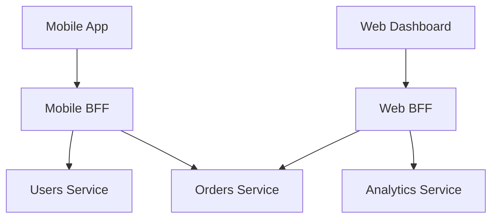

## In a nutshell

A Backend-for-Frontend (BFF) is a small backend service built specifically for one type of client -- like your mobile app or your web dashboard. It fetches data from your internal APIs and reshapes it into exactly what that client needs, so the mobile app gets a tiny, efficient payload while the web dashboard gets a rich, detailed one. It solves the problem of one generic API trying to serve wildly different clients.

## The situation

Your product has a mobile app and a web dashboard. Both show user profiles. The web dashboard displays 18 fields: name, email, role, team, manager, hire date, department, office location, timezone, bio, avatar, last login, two-factor status, notification preferences, connected integrations, activity log, permissions, and API key count. The mobile app shows 4: name, avatar, role, and last login.

Both hit `GET /api/users/usr_8a3f`. The mobile app downloads 3KB of JSON to display 200 bytes of useful data. On every single request.

You could add query parameters like `?fields=name,avatar,role,last_login`. But now every client is negotiating its data contract per request, your API documentation explodes, and you're implementing sparse fieldsets for every endpoint. For simple cases, that works. For complex UIs with nested resources, aggregated data, and client-specific business logic, it doesn't.

## The generic API problem

Here's what a generic API returns for a user profile:

```json
GET /api/users/usr_8a3f

{
  "id": "usr_8a3f",
  "name": "Alice Chen",
  "email": "alice@example.com",
  "role": "engineering_manager",
  "team": "Platform",
  "manager": {
    "id": "usr_k2m1",
    "name": "Bob Rivera"
  },
  "department": "Engineering",
  "office": "San Francisco",
  "timezone": "America/Los_Angeles",
  "hire_date": "2022-03-15",
  "bio": "Building platform tools for internal developers...",
  "avatar_url": "https://cdn.example.com/avatars/usr_8a3f.jpg",
  "last_login": "2026-04-13T09:15:00Z",
  "two_factor_enabled": true,
  "notification_preferences": {
    "email": true,
    "push": true,
    "slack": false
  },
  "connected_integrations": ["github", "jira", "slack"],
  "recent_activity": [
    { "action": "updated_profile", "at": "2026-04-12T16:30:00Z" },
    { "action": "created_api_key", "at": "2026-04-10T11:00:00Z" }
  ],
  "permissions": ["read:users", "write:users", "admin:team"],
  "api_key_count": 3
}
```

That's the web dashboard's dream response. It's the mobile app's nightmare.

## What a BFF looks like

A BFF is a backend service built for a specific client. It sits between the client and your internal APIs, fetching what's needed and reshaping it for that client's exact use case.



### Mobile BFF response

```json
GET /mobile/api/profile

{
  "name": "Alice Chen",
  "avatar_url": "https://cdn.example.com/avatars/usr_8a3f.jpg",
  "role": "Engineering Manager",
  "last_login": "9 hours ago"
}
```

Four fields. Human-readable role label instead of a slug. Relative timestamp instead of ISO 8601. Exactly what the mobile UI renders.

### Web BFF response

```json
GET /web/api/profile

{
  "user": {
    "id": "usr_8a3f",
    "name": "Alice Chen",
    "email": "alice@example.com",
    "role": "engineering_manager",
    "role_display": "Engineering Manager",
    "team": "Platform",
    "department": "Engineering",
    "manager": { "id": "usr_k2m1", "name": "Bob Rivera" },
    "office": "San Francisco",
    "timezone": "America/Los_Angeles",
    "hire_date": "2022-03-15",
    "bio": "Building platform tools for internal developers...",
    "avatar_url": "https://cdn.example.com/avatars/usr_8a3f.jpg"
  },
  "security": {
    "last_login": "2026-04-13T09:15:00Z",
    "two_factor_enabled": true,
    "api_key_count": 3
  },
  "preferences": {
    "notifications": { "email": true, "push": true, "slack": false },
    "connected_integrations": ["github", "jira", "slack"]
  },
  "activity": [
    { "action": "Updated profile", "at": "2026-04-12T16:30:00Z" },
    { "action": "Created API key", "at": "2026-04-10T11:00:00Z" }
  ],
  "permissions": ["read:users", "write:users", "admin:team"]
}
```

Same underlying data, but restructured for the dashboard layout. Fields grouped by UI section. Human-readable action labels. The dashboard doesn't need to transform anything — it maps directly onto the component tree.

<Callout type="aha" title="The key insight">
  <p>A BFF isn't just a filter that removes fields. It's a translation layer that reshapes data to match a specific client's mental model. It can aggregate from multiple services, compute derived values, format dates, and resolve references — all things you don't want the client doing.</p>
</Callout>

## What a BFF actually does

The mobile BFF for a home screen might call three internal services and compose a response the app can render directly:

```typescript
// Mobile BFF — GET /mobile/api/home
async function getHomeScreen(userId: string) {
  const [user, orders, notifications] = await Promise.all([
    usersService.getProfile(userId),
    ordersService.getRecent(userId, { limit: 3 }),
    notificationsService.getUnread(userId, { limit: 5 }),
  ]);

  return {
    greeting: `Welcome back, ${user.name.split(" ")[0]}`,
    avatar_url: user.avatar_url,
    unread_count: notifications.length,
    recent_orders: orders.map((o) => ({
      id: o.id,
      status: formatStatus(o.status),
      total: formatCurrency(o.total, o.currency),
      date: relativeTime(o.created_at),
    })),
    notifications: notifications.map((n) => ({
      title: n.title,
      body: truncate(n.body, 80),
      time: relativeTime(n.created_at),
    })),
  };
}
```

One request from the mobile app. Three internal calls made in parallel. The client receives exactly the shape it needs.

## When BFF makes sense

| Scenario | BFF? | Why |
|---|---|---|
| Mobile and web need the same data | No | Use sparse fieldsets or a single API with minor query params |
| Mobile and web need different shapes of the same data | Yes | Different aggregations, different formatting, different field sets |
| You have a single client (just a web app) | No | A BFF for one client is just... a backend |
| Third-party consumers with diverse needs | No | You can't build a BFF per partner. Use flexible APIs with good query design |
| Mobile needs aggressive payload optimization | Yes | Every byte counts on cellular. BFF reduces payload size and round trips |
| Multiple teams own different clients | Yes | Each team owns their BFF and iterates independently |

<Callout type="warning" title="The duplication trap">
  <p>With multiple BFFs, you'll be tempted to share code between them. Resist this. Shared libraries between BFFs create coupling — the exact thing BFFs are meant to eliminate. Each BFF should be independently deployable. Duplicate the data-fetching code. It's cheap compared to the cost of coordinated deployments.</p>
</Callout>

## BFF vs API Gateway

These patterns complement each other, but they solve different problems:

| Concern | API Gateway | BFF |
|---|---|---|
| **Purpose** | Infrastructure: routing, auth, rate limiting | Client optimization: data shaping, aggregation |
| **Knows about** | Paths, tokens, headers | Client UI structure, business domain |
| **One per** | System (or environment) | Client type (mobile, web, TV, etc.) |
| **Contains business logic** | Never | Sometimes (formatting, aggregation, derived values) |
| **Owned by** | Platform/infrastructure team | Client team |

In practice, requests often flow through both:


## Checklist: do you need a BFF?

- [ ] Do you have more than one client type with meaningfully different data needs?
- [ ] Are your clients doing significant data transformation on the client side?
- [ ] Is payload size causing performance issues on mobile or constrained networks?
- [ ] Do different client teams want to iterate on their API independently?
- [ ] Are you willing to deploy and maintain a separate service per client type?

---

*Next up: Event-Driven APIs — when synchronous request/response isn't the right model and your services need to react to things that happened.*
