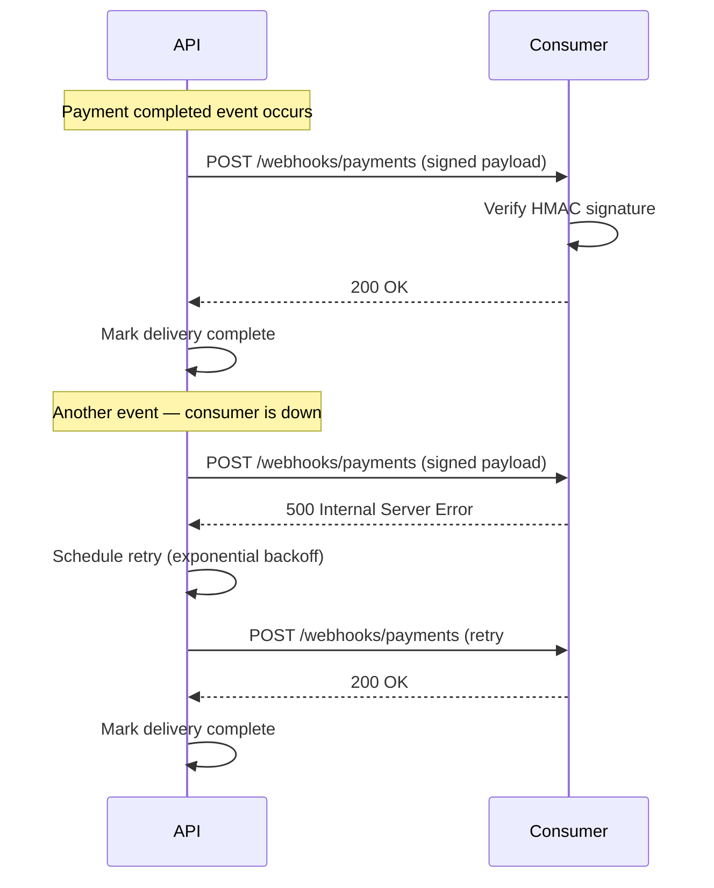
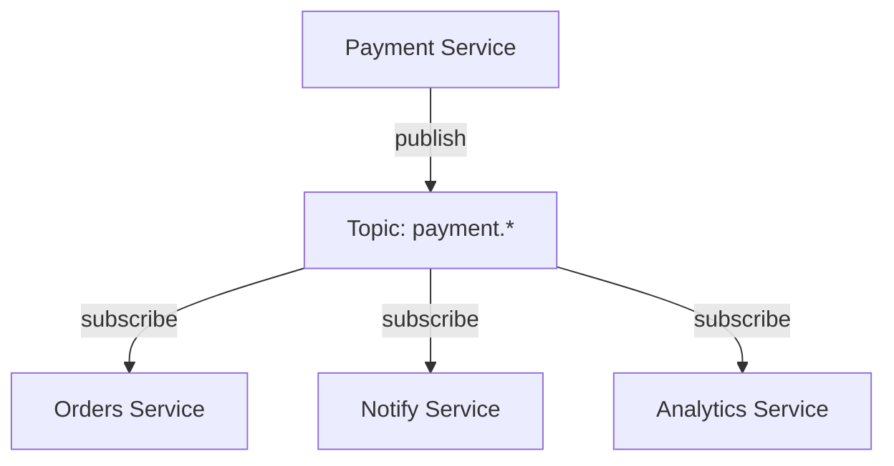

## In a nutshell

Instead of clients constantly asking your API "has anything changed?", event-driven APIs push updates when something happens. Webhooks send an HTTP request to a URL you provide. Server-Sent Events stream updates over an open connection. Pub/sub systems broadcast events to multiple services at once. Each pattern trades the simplicity of request/response for the ability to react to things in real time.

## The situation

You build a payment processing API. Your merchant wants to know when a payment succeeds. They poll `GET /api/payments/pay_x7k9` every 2 seconds. So do their 10,000 other merchants. Your API handles 5,000 requests per second, 98% of which return the same "still processing" response. Your infrastructure bill is climbing. Your API is doing busywork.

Polling is request/response applied to a problem that needs push.

## Webhooks: async HTTP callbacks

Webhooks are the simplest event-driven pattern. When something happens, your system sends an HTTP POST to a URL the consumer registered in advance. Here's the flow at a glance:



### Registering a webhook

```bash
curl -X POST https://api.example.com/webhooks \
  -H "Authorization: Bearer sk_live_abc123" \
  -H "Content-Type: application/json" \
  -d '{
    "url": "https://merchant.com/webhooks/payments",
    "events": ["payment.completed", "payment.failed", "refund.created"],
    "secret": "whsec_m3rch4nt_s3cr3t"
  }'
```

```http
HTTP/1.1 201 Created
Content-Type: application/json

{
  "id": "wh_endpoint_k8n2",
  "url": "https://merchant.com/webhooks/payments",
  "events": ["payment.completed", "payment.failed", "refund.created"],
  "status": "active",
  "created_at": "2026-04-13T10:00:00Z"
}
```

### Webhook payload delivery

When a payment completes, your system sends:

```http
POST https://merchant.com/webhooks/payments HTTP/1.1
Content-Type: application/json
X-Webhook-Id: evt_p9r2m4
X-Webhook-Timestamp: 1712937600
X-Webhook-Signature: sha256=d4e5f6a7b8c9d0e1f2a3b4c5d6e7f8a9b0c1d2e3f4a5b6c7d8e9f0a1b2c3d4e5

{
  "id": "evt_p9r2m4",
  "type": "payment.completed",
  "created_at": "2026-04-13T10:05:00Z",
  "data": {
    "payment_id": "pay_x7k9",
    "amount": 4998,
    "currency": "usd",
    "merchant_id": "merch_abc",
    "customer_email": "buyer@example.com",
    "metadata": {
      "order_id": "ord_w2m1"
    }
  }
}
```

### Signature verification

The consumer must verify the signature to ensure the payload wasn't tampered with:

```typescript
import crypto from "crypto";

function verifyWebhookSignature(
  payload: string,
  signature: string,
  timestamp: string,
  secret: string
): boolean {
  const signedContent = `${timestamp}.${payload}`;
  const expected = crypto
    .createHmac("sha256", secret)
    .update(signedContent)
    .digest("hex");

  return crypto.timingSafeEqual(
    Buffer.from(`sha256=${expected}`),
    Buffer.from(signature)
  );
}
```

<Callout type="warning" title="Always verify signatures">
  <p>Without signature verification, anyone can POST to your webhook endpoint pretending to be the payment provider. Always use <code>timingSafeEqual</code> to prevent timing attacks. Always include the timestamp in the signed content to prevent replay attacks.</p>
</Callout>

### Webhook delivery guarantees

Webhooks use HTTP, which means they can fail. Your delivery system needs retry logic:

```json
{
  "delivery_attempts": [
    {
      "attempt": 1,
      "timestamp": "2026-04-13T10:05:00Z",
      "response_status": 500,
      "next_retry": "2026-04-13T10:06:00Z"
    },
    {
      "attempt": 2,
      "timestamp": "2026-04-13T10:06:00Z",
      "response_status": 500,
      "next_retry": "2026-04-13T10:11:00Z"
    },
    {
      "attempt": 3,
      "timestamp": "2026-04-13T10:11:00Z",
      "response_status": 200,
      "success": true
    }
  ],
  "retry_schedule": "1min, 5min, 30min, 2hr, 8hr, 24hr"
}
```

The consumer must return `2xx` within a timeout (typically 5-30 seconds). Anything else triggers a retry with exponential backoff. After exhausting retries, the event goes to a dead letter queue for manual inspection.

## Server-Sent Events (SSE): real-time streaming

SSE is a one-directional stream from server to client over HTTP. The client opens a connection, and the server pushes events as they happen. No polling, no WebSocket complexity.

```bash
curl -N -H "Authorization: Bearer sk_live_abc123" \
  https://api.example.com/events/stream?types=payment.completed,payment.failed
```

The server responds with a `text/event-stream` content type and keeps the connection open:

```text
HTTP/1.1 200 OK
Content-Type: text/event-stream
Cache-Control: no-cache
Connection: keep-alive

event: payment.completed
id: evt_p9r2m4
data: {"payment_id":"pay_x7k9","amount":4998,"currency":"usd","merchant_id":"merch_abc"}

event: payment.completed
id: evt_q1s5n7
data: {"payment_id":"pay_m3k2","amount":12500,"currency":"usd","merchant_id":"merch_abc"}

event: payment.failed
id: evt_r3t8w2
data: {"payment_id":"pay_j9f1","amount":7500,"currency":"usd","reason":"insufficient_funds"}

```

Each event has three parts:
- `event:` — the event type (used for client-side routing)
- `id:` — a unique identifier (used for reconnection)
- `data:` — the JSON payload (can span multiple lines)

The blank line between events is required by the SSE spec. It signals the end of one event.

<Callout type="tip" title="Automatic reconnection">
  <p>SSE has built-in reconnection. If the connection drops, the browser automatically reconnects and sends a <code>Last-Event-ID</code> header with the last received <code>id</code>. Your server can use this to resume the stream from where the client left off. Built-in at-least-once delivery at the client level — the server may re-send the last event on reconnection, so clients should still handle duplicates.</p>
</Callout>

## Pub/sub: event broadcasting

When multiple services need to react to the same event, you need a message broker. The producer publishes an event to a topic. Consumers subscribe to topics they care about. The broker handles delivery.



### Pub/sub message format

A message on the `payment.completed` topic:

```json
{
  "message_id": "msg_f4g7h2",
  "topic": "payment.completed",
  "published_at": "2026-04-13T10:05:00Z",
  "producer": "payment-service",
  "data": {
    "payment_id": "pay_x7k9",
    "amount": 4998,
    "currency": "usd",
    "merchant_id": "merch_abc",
    "order_id": "ord_w2m1"
  },
  "metadata": {
    "correlation_id": "req_abc123",
    "schema_version": "1.2",
    "content_type": "application/json"
  }
}
```

The `correlation_id` lets you trace the event back through the request that triggered it. The `schema_version` lets consumers handle format changes gracefully.

## Delivery guarantees

The hardest part of event-driven systems is knowing whether an event was processed:

| Guarantee | Meaning | How |
|---|---|---|
| **At-most-once** | Event might be lost, never duplicated | Fire and forget. No retries. |
| **At-least-once** | Event is never lost, might be duplicated | Retry until acknowledged. Consumer must be idempotent. |
| **Exactly-once** | Event processed exactly one time | At-least-once delivery + idempotent processing on the consumer side. |

True exactly-once delivery is impossible in distributed systems. What you actually implement is at-least-once delivery with idempotent consumers:

```typescript
async function handlePaymentCompleted(event: PaymentEvent) {
  // Idempotency check: have we already processed this event?
  const existing = await db.processedEvents.findByEventId(event.id);
  if (existing) {
    console.log(`Event ${event.id} already processed, skipping`);
    return;
  }

  // Process the event
  await db.transaction(async (tx) => {
    await tx.orders.updateStatus(event.data.order_id, "paid");
    await tx.processedEvents.insert({
      event_id: event.id,
      processed_at: new Date(),
    });
  });
}
```

The `processedEvents` table acts as a deduplication log. The transaction ensures atomicity — the order update and the dedup record are committed together or not at all.

<Callout type="aha" title="Idempotency is non-negotiable">
  <p>In event-driven systems, duplicate delivery isn't a bug — it's a feature of reliable delivery. Every consumer must handle duplicates gracefully. If processing the same event twice causes a double charge, a duplicate email, or corrupted data, your system is broken regardless of your broker's delivery guarantees.</p>
</Callout>

## Dead letter queues

When an event can't be processed after all retries are exhausted, it goes to a dead letter queue (DLQ):

```json
{
  "dead_letter_entry": {
    "original_message_id": "msg_f4g7h2",
    "topic": "payment.completed",
    "consumer_group": "order-service",
    "failure_reason": "order_not_found",
    "attempts": 5,
    "first_attempt": "2026-04-13T10:05:00Z",
    "last_attempt": "2026-04-13T18:05:00Z",
    "last_error": "Order ord_w2m1 not found in database",
    "original_payload": {
      "payment_id": "pay_x7k9",
      "amount": 4998,
      "order_id": "ord_w2m1"
    }
  }
}
```

DLQs let you inspect failures without blocking the main queue. You monitor them, fix the root cause, and replay the events. Without a DLQ, failed events disappear silently.

## Choosing the right pattern

| Pattern | Best for | Complexity | Infrastructure |
|---|---|---|---|
| **Webhooks** | Notifying external consumers | Low | Just HTTP |
| **SSE** | Real-time UI updates, streaming | Low | HTTP with long-lived connections |
| **WebSockets** | Bidirectional real-time (chat, gaming) | Medium | Persistent connections, custom protocol |
| **Pub/sub** (Kafka, SNS, RabbitMQ) | Internal service-to-service events | High | Message broker infrastructure |

## Checklist: going event-driven

- [ ] Can your consumers handle duplicate events (idempotent processing)?
- [ ] Do you have a dead letter queue strategy for failed events?
- [ ] Is the event payload self-contained (consumer doesn't need to call back for details)?
- [ ] Have you defined your delivery guarantee (at-least-once is the pragmatic default)?
- [ ] Do you have a way to replay events when things go wrong?
- [ ] Are your event schemas versioned?

---

*Next up: GraphQL — when it solves real problems, when it creates new ones, and how to decide if it's right for your API.*
