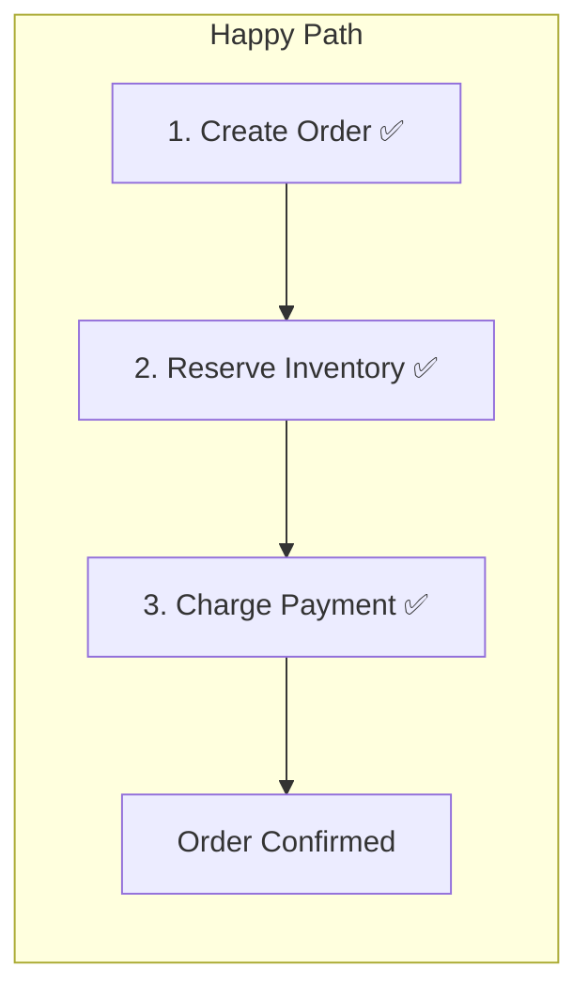
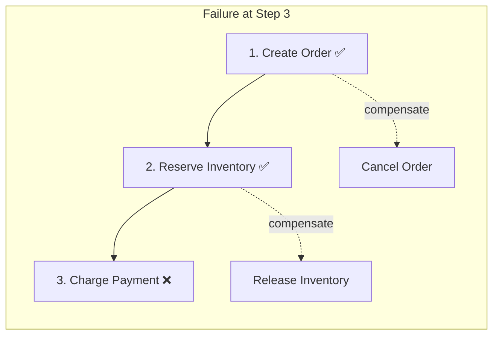
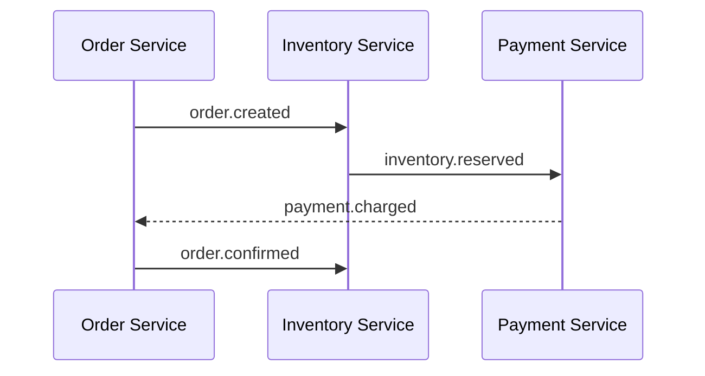
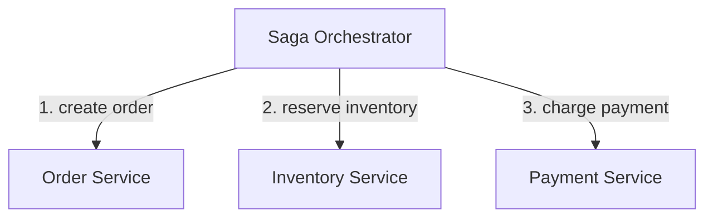

## In a nutshell

When a business operation spans multiple services -- like placing an order that involves creating the order, reserving inventory, and charging payment -- you can't wrap it all in a single database transaction. A saga breaks the operation into a chain of smaller steps, each in its own service, with a defined "undo" action for every step. If step three fails, the undo actions run in reverse to clean up steps one and two.

## The situation

A customer places an order on your e-commerce platform. Three things need to happen:

1. **Order Service** creates the order
2. **Inventory Service** reserves the items
3. **Payment Service** charges the customer's card

In a monolith, you'd wrap all three in a database transaction. If payment fails, everything rolls back. Clean, atomic, simple.

But you have microservices. Each service has its own database. There is no shared transaction. If payment fails after inventory is reserved, you're stuck with ghost reservations. If inventory fails after the order is created, you have an order with no items.

You can't use a distributed transaction (two-phase commit) because it's slow, fragile, and doesn't scale. You need a saga.

## What a saga is

A saga is a sequence of **local transactions**, each executed by a different service. Each step has a **compensating action** — a way to undo its effect if a later step fails. Instead of one atomic transaction, you get a chain of smaller ones with explicit rollback logic.





Each compensation undoes exactly one step. They run in reverse order. The system ends up in a consistent state — not the committed state, but a cleanly rolled-back one.

## The happy path

### Step 1: Create order

```bash
curl -X POST https://orders.internal/api/orders \
  -H "Content-Type: application/json" \
  -H "X-Saga-Id: saga_q8r3t5" \
  -d '{
    "customer_id": "cust_8a3f",
    "items": [
      { "sku": "WIDGET-42", "quantity": 2, "price": 24.99 },
      { "sku": "GADGET-17", "quantity": 1, "price": 89.00 }
    ]
  }'
```

```json
HTTP/1.1 201 Created

{
  "order_id": "ord_x7k9",
  "saga_id": "saga_q8r3t5",
  "status": "pending",
  "total": 138.98,
  "items": [
    { "sku": "WIDGET-42", "quantity": 2, "price": 24.99 },
    { "sku": "GADGET-17", "quantity": 1, "price": 89.00 }
  ],
  "created_at": "2026-04-13T14:32:00Z"
}
```

### Step 2: Reserve inventory

```bash
curl -X POST https://inventory.internal/api/reservations \
  -H "Content-Type: application/json" \
  -H "X-Saga-Id: saga_q8r3t5" \
  -d '{
    "order_id": "ord_x7k9",
    "items": [
      { "sku": "WIDGET-42", "quantity": 2 },
      { "sku": "GADGET-17", "quantity": 1 }
    ]
  }'
```

```json
HTTP/1.1 201 Created

{
  "reservation_id": "res_m4n7p2",
  "saga_id": "saga_q8r3t5",
  "order_id": "ord_x7k9",
  "status": "reserved",
  "items": [
    { "sku": "WIDGET-42", "quantity": 2, "available_before": 150 },
    { "sku": "GADGET-17", "quantity": 1, "available_before": 43 }
  ],
  "expires_at": "2026-04-13T14:47:00Z"
}
```

Notice the `expires_at` field. Reservations are time-limited. If the saga doesn't complete within 15 minutes, the reservation auto-releases. This is a safety net against sagas that get stuck.

### Step 3: Charge payment

```bash
curl -X POST https://payments.internal/api/charges \
  -H "Content-Type: application/json" \
  -H "X-Saga-Id: saga_q8r3t5" \
  -d '{
    "order_id": "ord_x7k9",
    "customer_id": "cust_8a3f",
    "amount": 138.98,
    "currency": "usd",
    "idempotency_key": "saga_q8r3t5_charge"
  }'
```

```json
HTTP/1.1 201 Created

{
  "charge_id": "chg_k9j2m5",
  "saga_id": "saga_q8r3t5",
  "order_id": "ord_x7k9",
  "amount": 138.98,
  "currency": "usd",
  "status": "succeeded",
  "charged_at": "2026-04-13T14:32:03Z"
}
```

All three steps succeeded. The saga is complete. The order is confirmed.

## When step 3 fails

The card is declined. Now you need to undo steps 1 and 2.

```json
HTTP/1.1 402 Payment Required

{
  "error": "payment_failed",
  "charge_id": "chg_k9j2m5",
  "reason": "card_declined",
  "decline_code": "insufficient_funds"
}
```

### Compensate step 2: Release inventory

```bash
curl -X DELETE https://inventory.internal/api/reservations/res_m4n7p2 \
  -H "X-Saga-Id: saga_q8r3t5"
```

```json
HTTP/1.1 200 OK

{
  "reservation_id": "res_m4n7p2",
  "status": "released",
  "items": [
    { "sku": "WIDGET-42", "quantity": 2, "available_after": 152 },
    { "sku": "GADGET-17", "quantity": 1, "available_after": 44 }
  ],
  "released_at": "2026-04-13T14:32:04Z"
}
```

### Compensate step 1: Cancel order

```bash
curl -X PATCH https://orders.internal/api/orders/ord_x7k9 \
  -H "Content-Type: application/json" \
  -H "X-Saga-Id: saga_q8r3t5" \
  -d '{
    "status": "cancelled",
    "reason": "payment_declined"
  }'
```

```json
HTTP/1.1 200 OK

{
  "order_id": "ord_x7k9",
  "status": "cancelled",
  "reason": "payment_declined",
  "cancelled_at": "2026-04-13T14:32:04Z"
}
```

The system is back to a consistent state. No ghost reservations. No orphaned orders.

<Callout type="aha" title="Compensation is not undo">
  <p>A compensating action doesn't reverse time. It creates a new transaction that semantically negates the previous one. A payment refund is not "un-charging" the card — it's a new credit transaction. An inventory release is not "un-reserving" — it's a new stock adjustment. This distinction matters because compensations are visible in audit logs, accounting records, and event streams.</p>
</Callout>

## Choreography vs orchestration

There are two ways to coordinate a saga: let services talk to each other (choreography) or have a central coordinator manage the flow (orchestration).

### Choreography: event-driven coordination

Each service publishes events. Other services subscribe and react. No central coordinator.



Event payloads for the choreography flow:

```json
// Published by Order Service
{
  "type": "order.created",
  "saga_id": "saga_q8r3t5",
  "data": {
    "order_id": "ord_x7k9",
    "customer_id": "cust_8a3f",
    "items": [
      { "sku": "WIDGET-42", "quantity": 2 },
      { "sku": "GADGET-17", "quantity": 1 }
    ],
    "total": 138.98
  }
}
```

```json
// Published by Inventory Service (after reserving)
{
  "type": "inventory.reserved",
  "saga_id": "saga_q8r3t5",
  "data": {
    "order_id": "ord_x7k9",
    "reservation_id": "res_m4n7p2",
    "items": [
      { "sku": "WIDGET-42", "quantity": 2 },
      { "sku": "GADGET-17", "quantity": 1 }
    ]
  }
}
```

```json
// Published by Payment Service (after charging)
{
  "type": "payment.charged",
  "saga_id": "saga_q8r3t5",
  "data": {
    "order_id": "ord_x7k9",
    "charge_id": "chg_k9j2m5",
    "amount": 138.98
  }
}
```

If payment fails, the Payment Service publishes `payment.failed`. Inventory Service subscribes to that event and releases its reservation. Order Service subscribes and cancels the order.

```json
// Published by Payment Service (on failure)
{
  "type": "payment.failed",
  "saga_id": "saga_q8r3t5",
  "data": {
    "order_id": "ord_x7k9",
    "reason": "card_declined",
    "decline_code": "insufficient_funds"
  }
}
```

### Orchestration: central coordinator

A saga orchestrator tells each service what to do and handles failures centrally.



The orchestrator maintains the saga state:

```json
{
  "saga_id": "saga_q8r3t5",
  "type": "place_order",
  "status": "compensating",
  "started_at": "2026-04-13T14:32:00Z",
  "current_step": "compensate_inventory",
  "steps": [
    {
      "name": "create_order",
      "service": "order-service",
      "status": "compensating",
      "result": { "order_id": "ord_x7k9" }
    },
    {
      "name": "reserve_inventory",
      "service": "inventory-service",
      "status": "compensated",
      "result": { "reservation_id": "res_m4n7p2" },
      "compensated_at": "2026-04-13T14:32:05Z"
    },
    {
      "name": "charge_payment",
      "service": "payment-service",
      "status": "failed",
      "error": { "reason": "card_declined" },
      "failed_at": "2026-04-13T14:32:03Z"
    }
  ]
}
```

<Callout type="tip" title="When to use which">
  <p>Choreography works for simple sagas with 2-3 steps where the flow is linear. Orchestration is better when you have 4+ steps, conditional branching, or you need visibility into the saga's state. Most teams start with choreography and switch to orchestration when debugging event chains becomes painful.</p>
</Callout>

## Comparing the two approaches

| Factor | Choreography | Orchestration |
|---|---|---|
| **Coupling** | Loose — services only know about events | Tighter — orchestrator knows all services |
| **Visibility** | Hard to see the full flow | Saga state is centralized and inspectable |
| **Complexity** | Distributed — each service has partial logic | Centralized — one place to understand the flow |
| **Adding steps** | Touch multiple services | Touch the orchestrator only |
| **Debugging** | Requires distributed tracing across events | Check the orchestrator's saga log |
| **Single point of failure** | None | The orchestrator (must be highly available) |
| **Best for** | Simple, linear flows | Complex flows with branching or many steps |

## Common pitfalls

### Compensation can fail too

What if the inventory release fails during compensation? You need retries on compensations, and eventually a manual intervention queue:

```json
{
  "saga_id": "saga_q8r3t5",
  "status": "compensation_failed",
  "stuck_step": "compensate_inventory",
  "attempts": 5,
  "last_error": "inventory-service unavailable",
  "requires_manual_intervention": true,
  "alert_sent_to": "ops-team@example.com"
}
```

### Observability is critical

Every saga step should emit structured logs with the `saga_id`:

```json
{
  "timestamp": "2026-04-13T14:32:03Z",
  "level": "error",
  "service": "payment-service",
  "saga_id": "saga_q8r3t5",
  "step": "charge_payment",
  "action": "failed",
  "order_id": "ord_x7k9",
  "reason": "card_declined",
  "next_action": "trigger_compensation"
}
```

Without consistent `saga_id` correlation, debugging a failed saga across three services and a message broker is an exercise in frustration.

<Callout type="warning" title="Sagas don't give you isolation">
  <p>A database transaction gives you isolation — other transactions can't see intermediate states. A saga has no isolation. Between Step 1 and Step 3, the order exists but isn't paid. Other parts of the system can see this intermediate state. Design your read paths to handle it — show "processing" statuses, filter out unpaid orders from reports, and don't send confirmation emails until the saga completes.</p>
</Callout>

## Checklist: implementing a saga

- [ ] Can you define a compensating action for every step?
- [ ] Are all your saga steps idempotent (safe to retry)?
- [ ] Do you have a strategy for compensation failures?
- [ ] Is every event/request tagged with a `saga_id` for tracing?
- [ ] Have you designed your UI for intermediate states (pending, processing)?
- [ ] Do you have timeouts for stuck sagas?
- [ ] Have you decided between choreography and orchestration?

---

*Next up: Authentication vs Authorization — two words that aren't synonyms, no matter how many people use them interchangeably.*
