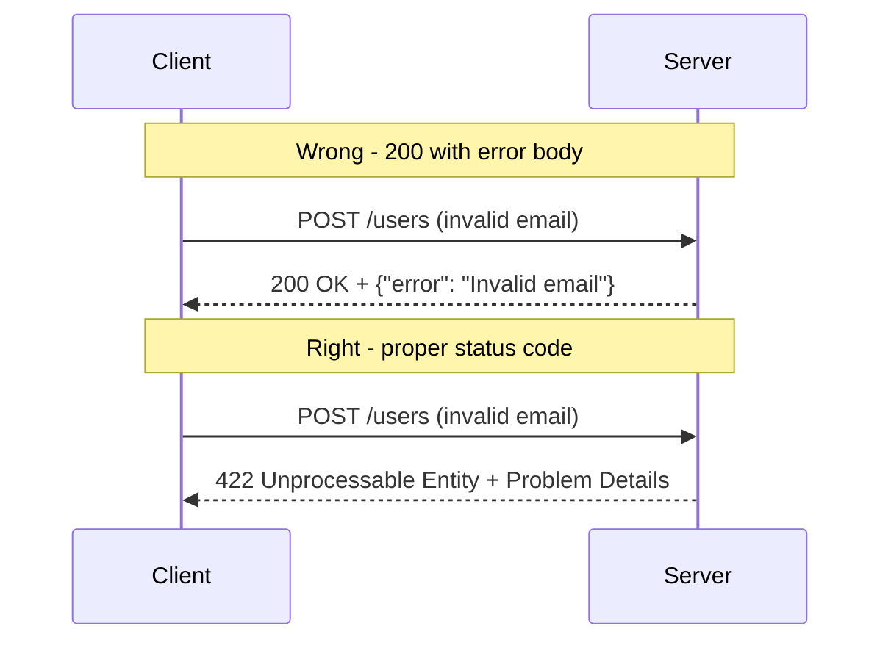

## In a nutshell

When something goes wrong with an API request, the response needs to clearly say what happened and why. HTTP status codes (like 404 for "not found" or 422 for "bad data") tell tools and code how to react automatically, while the response body gives the developer enough detail to fix the problem. Getting this wrong -- like returning "200 OK" when there's actually an error -- breaks every tool in the chain.

## The situation

You're integrating with a third-party API. You send a request. You get back:

```json
HTTP/1.1 200 OK

{
  "status": 200,
  "error": true,
  "message": "User not found"
}
```

Status code says 200 — success. Body says error. Your HTTP client thinks everything is fine. Your error handling logic never triggers. You discover the bug three days later in production.

This is depressingly common, and it's completely avoidable.

Here's the difference between the wrong way and the right way to return errors:



## The anti-pattern: errors wrapped in 200

```json
HTTP/1.1 200 OK

{
  "success": false,
  "error": {
    "code": "NOT_FOUND",
    "message": "The requested user does not exist"
  }
}
```

This breaks every tool in the HTTP ecosystem. Caches cache it as a successful response. Monitoring dashboards report 100% success rate. Load balancers don't detect backend failures. API gateways don't trigger retry logic.

HTTP status codes exist for a reason. Use them.

```json
HTTP/1.1 404 Not Found

{
  "type": "https://api.example.com/errors/not-found",
  "title": "Resource not found",
  "status": 404,
  "detail": "No user found with ID user_999."
}
```

<Callout type="aha" title="Status codes are machine-readable semantics">
  <p>Status codes aren't just for humans reading logs. They drive behavior in HTTP clients, proxies, CDNs, and monitoring tools. A 429 triggers backoff logic. A 503 triggers circuit breakers. A 401 triggers token refresh. Wrapping everything in 200 disables all of this for free.</p>
</Callout>

## Status code quick reference

You don't need to memorize all 70+ HTTP status codes. These are the ones that matter for APIs:

### Success (2xx)

| Code | Meaning | When to use |
|---|---|---|
| 200 | OK | Successful GET, PUT, PATCH |
| 201 | Created | Successful POST that creates a resource |
| 204 | No Content | Successful DELETE (no body to return) |

### Client errors (4xx)

| Code | Meaning | When to use |
|---|---|---|
| 400 | Bad Request | Malformed request body, invalid JSON, type mismatches |
| 401 | Unauthorized | Missing or invalid authentication credentials |
| 403 | Forbidden | Authenticated but not authorized for this action |
| 404 | Not Found | Resource doesn't exist |
| 409 | Conflict | Resource state conflict (duplicate email, version mismatch) |
| 422 | Unprocessable Entity | Request is well-formed but semantically invalid (validation errors) |
| 429 | Too Many Requests | Rate limit exceeded |

### Server errors (5xx)

| Code | Meaning | When to use |
|---|---|---|
| 500 | Internal Server Error | Unhandled exception — something broke |
| 502 | Bad Gateway | Upstream service returned an invalid response |
| 503 | Service Unavailable | Server is temporarily down (maintenance, overload) |
| 504 | Gateway Timeout | Upstream service didn't respond in time |

<Callout type="tip" title="400 vs 422">
  <p>Use <strong>400</strong> when the request is syntactically broken (malformed JSON, wrong content type). Use <strong>422</strong> when the syntax is fine but the data doesn't pass validation (email already taken, end date before start date). This distinction helps consumers separate "fix your request format" from "fix your data."</p>
</Callout>

## RFC 7807: Problem Details

RFC 7807 (updated by RFC 9457) defines a standard JSON format for error responses. Instead of every API inventing its own error shape, use this:

```json
HTTP/1.1 403 Forbidden
Content-Type: application/problem+json

{
  "type": "https://api.example.com/errors/insufficient-permissions",
  "title": "Insufficient permissions",
  "status": 403,
  "detail": "You need the 'admin' role to delete projects.",
  "instance": "/api/projects/proj_123"
}
```

| Field | Required | Description |
|---|---|---|
| `type` | Yes | A URI identifying the error type (can be a docs link) |
| `title` | Yes | A short, human-readable summary |
| `status` | Yes | The HTTP status code (matches the response status) |
| `detail` | No | A human-readable explanation specific to this occurrence |
| `instance` | No | A URI identifying the specific request that caused the error |

You can add extension fields for machine-readable data:

```json
HTTP/1.1 429 Too Many Requests
Content-Type: application/problem+json
Retry-After: 30

{
  "type": "https://api.example.com/errors/rate-limit-exceeded",
  "title": "Rate limit exceeded",
  "status": 429,
  "detail": "You've exceeded 100 requests per minute. Try again in 30 seconds.",
  "retryAfter": 30,
  "limit": 100,
  "remaining": 0,
  "resetAt": "2026-04-13T14:05:00Z"
}
```

## Validation errors with field-level detail

Generic error messages like *"Validation failed"* are useless. Tell the consumer exactly which fields failed and why:

```json
HTTP/1.1 422 Unprocessable Entity
Content-Type: application/problem+json

{
  "type": "https://api.example.com/errors/validation-error",
  "title": "Validation failed",
  "status": 422,
  "detail": "The request body contains 3 validation errors.",
  "errors": [
    {
      "field": "email",
      "message": "Must be a valid email address.",
      "value": "not-an-email"
    },
    {
      "field": "password",
      "message": "Must be at least 8 characters.",
      "value": null
    },
    {
      "field": "dateOfBirth",
      "message": "Must be a date in the past.",
      "value": "2030-01-01"
    }
  ]
}
```

This format lets consumers:
- Highlight specific form fields with their errors
- Display all validation issues at once (not one at a time)
- Programmatically map errors to UI elements using the `field` key

<Callout type="warning" title="Never leak internals in error messages">
  <p>Error details should help consumers fix their request. They should never expose stack traces, SQL queries, internal service names, or file paths. Log those server-side. Return a clean, actionable message to the consumer.</p>
</Callout>

## Common mistakes

### Using 200 for everything

```json
// Don't
HTTP/1.1 200 OK
{ "error": "Unauthorized" }

// Do
HTTP/1.1 401 Unauthorized
{ "type": "...", "title": "Authentication required", "status": 401 }
```

### Using 500 for client errors

```json
// Don't — this isn't a server error, the client sent bad data
HTTP/1.1 500 Internal Server Error
{ "message": "Email is required" }

// Do
HTTP/1.1 422 Unprocessable Entity
{ "type": "...", "title": "Validation failed", "status": 422, "errors": [...] }
```

### Inconsistent error shapes

```json
// Endpoint A returns this
{ "error": "Not found" }

// Endpoint B returns this
{ "message": "Resource does not exist", "code": 404 }

// Endpoint C returns this
{ "errors": [{ "msg": "missing" }] }
```

Pick one error format (RFC 7807) and use it everywhere. Consumers should be able to write a single error handler for your entire API.

<Callout type="tip" title="Centralize error handling in your framework">
  <p>Create a shared error middleware that catches exceptions and formats them as Problem Details. This ensures consistency even when individual handlers forget to format their errors properly.</p>
</Callout>

## Error response checklist

- [ ] Status codes match the error category (4xx for client, 5xx for server)
- [ ] Error body follows RFC 7807 Problem Details format
- [ ] Validation errors include **field-level** details
- [ ] Error messages are actionable ("email must be valid" not "validation error")
- [ ] Internal details (stack traces, SQL) are **never** exposed to consumers
- [ ] Error format is **identical** across all endpoints
- [ ] `Retry-After` header is included with 429 and 503 responses

---

*Next up: schema evolution and versioning — because the best API version is the one you never have to create.*
