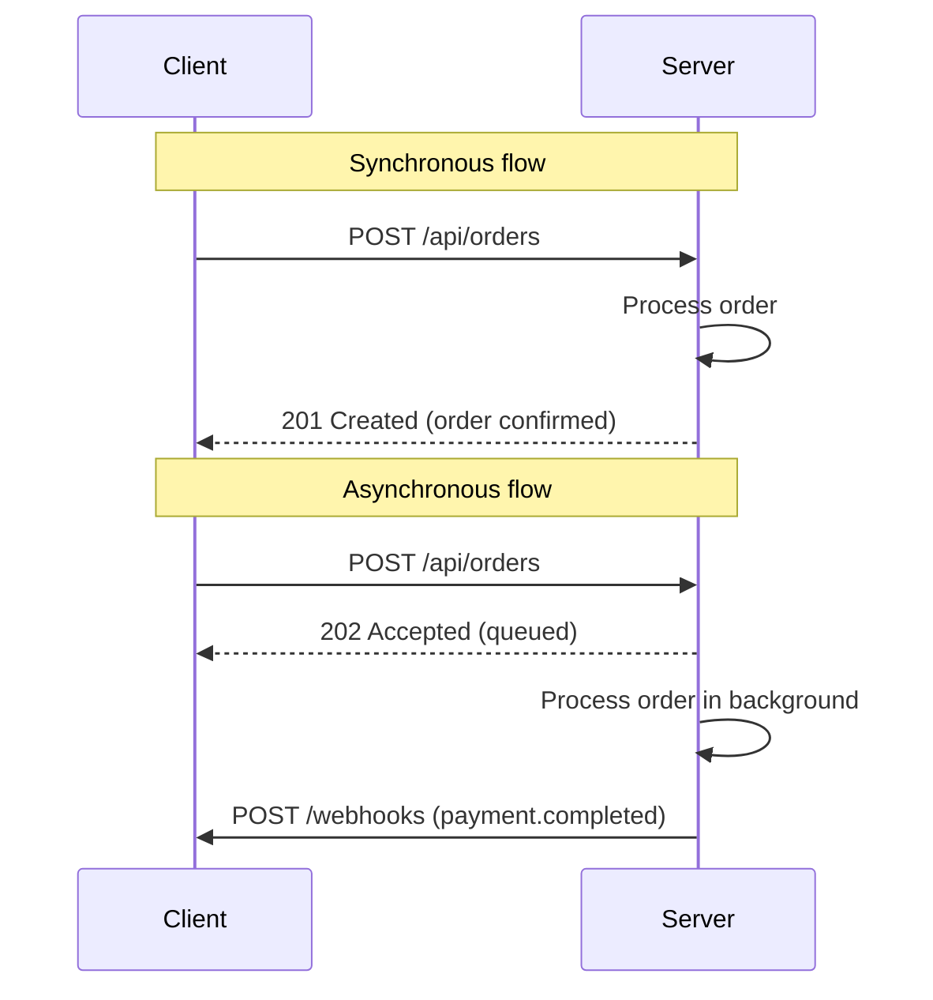

## In a nutshell

When your code calls an API synchronously, it sends a request and waits for the answer before doing anything else. When it calls asynchronously, it sends the request and moves on -- the result arrives later. This choice shapes everything about how your system handles failures, scales under load, and stays responsive to users.

## The situation

Your checkout service calls the payment service, which calls the fraud service, which calls the risk-scoring service. Each one waits for the next. A 200ms spike in risk scoring cascades into a 3-second checkout. Users abandon carts. Revenue drops.

You've just discovered the cost of synchronous coupling.

Here's how synchronous and asynchronous flows differ at a glance:



## Synchronous: request and wait

In synchronous communication, the caller sends a request and **blocks until it gets a response**. This is the model most engineers learn first — it's HTTP, it's REST, it's how browsers work.

```http
// Request
POST /api/orders HTTP/1.1
Content-Type: application/json

{
  "user_id": "usr_8a3f",
  "items": [
    { "sku": "WIDGET-42", "quantity": 2 }
  ],
  "payment_method": "pm_visa_4242"
}
```

```http
// Response (caller blocked until this arrives)
HTTP/1.1 201 Created
Content-Type: application/json

{
  "order_id": "ord_x7k9",
  "status": "confirmed",
  "total": 49.98,
  "created_at": "2026-04-13T14:32:00Z"
}
```

The caller knows immediately whether the operation succeeded. It can show the user a confirmation screen. Simple, predictable, debuggable.

**But:** the caller is stuck waiting. If the downstream service is slow, the caller is slow. If it's down, the caller fails. Synchronous communication creates **temporal coupling** — both systems must be available at the same time.

## Asynchronous: fire and forget

In asynchronous communication, the caller sends a message and **moves on without waiting for a result**. The work happens later, somewhere else.

Here's the same order flow, but the payment processing happens via a webhook callback:

```http
// Step 1: Client submits the order (fast — just queues the work)
POST /api/orders HTTP/1.1
Content-Type: application/json

{
  "user_id": "usr_8a3f",
  "items": [
    { "sku": "WIDGET-42", "quantity": 2 }
  ],
  "payment_method": "pm_visa_4242"
}
```

```http
// Response (immediate — no payment processing yet)
HTTP/1.1 202 Accepted
Content-Type: application/json

{
  "order_id": "ord_x7k9",
  "status": "pending",
  "status_url": "/api/orders/ord_x7k9"
}
```

```http
// Step 2: Later, the payment service sends a webhook
POST https://your-app.com/webhooks/payments HTTP/1.1
Content-Type: application/json
X-Webhook-Signature: sha256=a1b2c3d4...

{
  "event": "payment.completed",
  "order_id": "ord_x7k9",
  "amount": 49.98,
  "currency": "USD",
  "completed_at": "2026-04-13T14:32:07Z"
}
```

Notice the `202 Accepted` — not `201 Created`. That status code is a signal: "I received your request and will process it, but I'm not done yet."

## Streaming: the middle ground

Server-Sent Events (SSE) and WebSockets sit between sync and async. The client opens a connection and receives a **continuous stream** of updates without polling.

```text
// SSE event stream for order status updates
GET /api/orders/ord_x7k9/events HTTP/1.1
Accept: text/event-stream

event: status_update
data: {"order_id":"ord_x7k9","status":"payment_processing","timestamp":"2026-04-13T14:32:01Z"}

event: status_update
data: {"order_id":"ord_x7k9","status":"payment_confirmed","timestamp":"2026-04-13T14:32:07Z"}

event: status_update
data: {"order_id":"ord_x7k9","status":"shipped","tracking":"1Z999AA10123456784","timestamp":"2026-04-13T15:10:22Z"}
```

Each `event:` + `data:` block is a discrete message pushed from the server. The client doesn't poll. The server doesn't wait. It's real-time without the complexity of a full message broker.

<Callout type="aha" title="The real distinction">
  <p>Sync vs async isn't about speed. It's about <strong>coupling</strong>. Synchronous communication couples the caller to the responder in time — both must be available simultaneously. Asynchronous communication decouples them — the producer and consumer can operate independently.</p>
</Callout>

## When to use which

| Factor | Synchronous (HTTP request/response) | Asynchronous (message queue / webhook) |
|---|---|---|
| **Need an immediate answer?** | Yes — user is waiting | No — can process later |
| **Failure handling** | Caller fails if downstream fails | Message is retried from the queue |
| **Complexity** | Low — one request, one response | Higher — message brokers, dead-letter queues, idempotency |
| **Debugging** | Easy — follow the request | Harder — distributed tracing needed |
| **Scalability** | Limited by slowest service in the chain | Producers and consumers scale independently |
| **Data consistency** | Immediate (within the request) | Eventual — consumer processes when ready |
| **Good for** | Reads, simple writes, user-facing flows | Background jobs, cross-service events, high-throughput writes |

### Common async patterns

- **Message queues** (RabbitMQ, SQS) — one producer, one consumer. Work distribution.
- **Pub/sub** (Kafka, SNS) — one producer, many consumers. Event broadcasting.
- **Webhooks** — async HTTP callbacks. The simplest async pattern — no broker needed.
- **SSE / WebSockets** — persistent connections for real-time streaming to clients.

<Callout type="tip" title="The pragmatic default">
  <p>Start synchronous. Move to async when you hit one of these: the downstream service is unreliable, the operation is slow, you need to fan out to multiple consumers, or you need to decouple deployment cycles between teams. Don't add a message broker because it sounds cool.</p>
</Callout>

## The hybrid reality

Most real systems use both. A typical e-commerce flow:

1. **Sync:** User submits order, gets back `202 Accepted` (fast acknowledgment)
2. **Async:** Order service publishes `order.created` event to a message queue
3. **Async:** Payment service picks up the event, processes payment, publishes `payment.completed`
4. **Async:** Inventory service picks up the event, reserves stock
5. **Sync or SSE:** Frontend polls or subscribes to order status updates

The art is knowing where to draw the boundary between sync and async. The rule of thumb: **keep the user-facing path synchronous and fast, push everything else to async processing.**

<Callout type="warning" title="The eventual consistency trap">
  <p>Async communication means eventual consistency. If your user creates an order and immediately navigates to "My Orders," the order might not be there yet. You need to design your UX and API for this — loading states, optimistic UI, or status polling endpoints.</p>
</Callout>

## Checklist: choosing your communication model

- [ ] Does the caller need the result immediately to proceed?
- [ ] Can the operation tolerate seconds or minutes of delay?
- [ ] What happens if the downstream service is unavailable?
- [ ] Do multiple services need to react to this event?
- [ ] Is the operation idempotent (safe to retry)?

---

*Next up: the protocol landscape — REST, GraphQL, gRPC, and the rest of the toolkit you should know about.*
