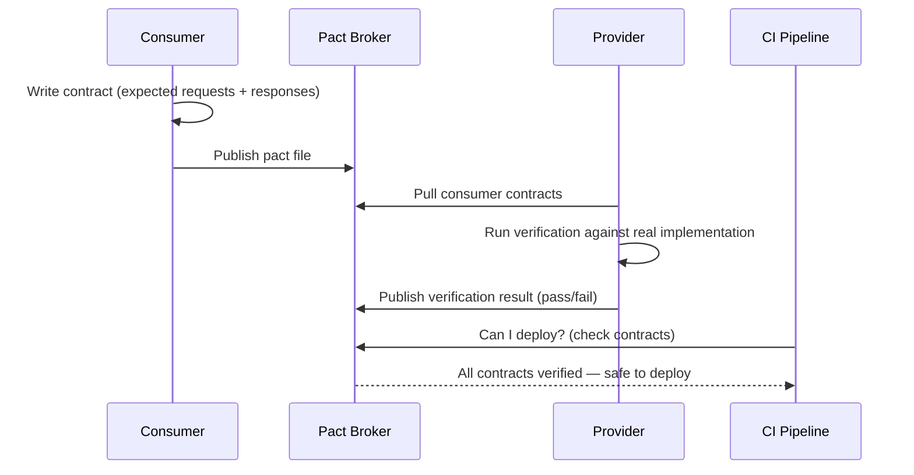

## In a nutshell

Contract testing verifies that two services agree on the shape of their API -- the fields, types, and status codes they exchange. It catches the common scenario where one team renames a field and breaks another team's service, even though both sides have passing unit tests. The tests run without needing the real services, so they're fast and reliable enough for your CI pipeline.

## The situation

Your `OrderService` calls the `UserService` to look up a customer's email. Both services have 95% unit test coverage. Both pass their integration tests. You deploy the `UserService` with a change that renames `email` to `email_address`. The `OrderService` breaks in production. Order confirmation emails stop sending. Nobody notices for 4 hours.

Unit tests didn't catch it because they test each service in isolation. Integration tests didn't catch it because they run against a shared staging environment that wasn't updated yet. The gap between "my service works" and "my service works with your service" is exactly where contract testing lives.

## The testing gap

| Test type | What it catches | What it misses |
|---|---|---|
| **Unit tests** | Logic errors within a single function or module | Anything that crosses a service boundary |
| **Integration tests** | Full-stack behavior with real dependencies | Slow, flaky, hard to maintain, often skipped in CI |
| **End-to-end tests** | User-visible behavior across the whole system | Expensive, brittle, slow feedback loop |
| **Contract tests** | Mismatches in the agreed API shape between two services | Internal logic errors (that's what unit tests are for) |

Contract tests fill the gap between unit tests and integration tests. They're fast (no real services needed), focused (only test the interface), and run in CI.

<Callout type="aha" title="The real insight">
  <p>Contract tests don't test behavior — they test <strong>agreements</strong>. Does the producer return the shape the consumer expects? Does the consumer send requests the producer can handle? If both sides honor the contract, integration works. If either side drifts, the test fails.</p>
</Callout>

Here's the flow at a glance:



## Consumer-driven contracts with Pact

Pact is the most widely used contract testing framework. The flow works in two directions: the consumer defines what it expects, and the provider verifies it delivers.

### Step 1: Consumer writes a contract

The consumer (the service making the call) defines its expectations — "I call `GET /users/usr_8a3f` and I need `id`, `name`, and `email` in the response."

This generates a **pact file** — a JSON contract:

```json
{
  "consumer": { "name": "OrderService" },
  "provider": { "name": "UserService" },
  "interactions": [
    {
      "description": "a request for a user by ID",
      "request": {
        "method": "GET",
        "path": "/users/usr_8a3f",
        "headers": {
          "Accept": "application/json"
        }
      },
      "response": {
        "status": 200,
        "headers": {
          "Content-Type": "application/json"
        },
        "body": {
          "id": "usr_8a3f",
          "name": "Alice Chen",
          "email": "alice@example.com"
        },
        "matchingRules": {
          "body": {
            "$.id": { "match": "type" },
            "$.name": { "match": "type" },
            "$.email": { "match": "regex", "regex": ".+@.+" }
          }
        }
      }
    }
  ]
}
```

Notice the `matchingRules` — the consumer doesn't care about exact values. It cares that `id` is a string, `name` is a string, and `email` matches an email pattern. The contract captures the **shape**, not the data.

### Step 2: Provider verifies the contract

The provider (the `UserService`) runs the pact file against its real implementation:

```bash
# Provider verification — run in UserService CI
npx pact-provider-verifier \
  --provider-base-url http://localhost:3000 \
  --pact-urls ./pacts/orderservice-userservice.json
```

```text
Verifying pact between OrderService and UserService

  a request for a user by ID
    with GET /users/usr_8a3f
      returns a response which
        has status code 200 ✓
        has a matching body ✓
          $.id -> type match ✓
          $.name -> type match ✓
          $.email -> regex match ✓

1 interaction, 0 failures
```

Every field the consumer relies on is verified. Every endpoint the consumer calls is tested.

## When contracts catch breaking changes

Here's the scenario that makes contract testing worth the investment.

A developer on the `UserService` team renames `email` to `email_address` for consistency with other services. They update their unit tests, everything passes, and they open a PR.

The CI pipeline runs the pact verification:

```text
Verifying pact between OrderService and UserService

  a request for a user by ID
    with GET /users/usr_8a3f
      returns a response which
        has status code 200 ✓
        has a matching body
          $.id -> type match ✓
          $.name -> type match ✓
          $.email -> regex match ✗ FAILED

        Expected response body to contain "email"
        but the key was not found in:
        {
          "id": "usr_8a3f",
          "name": "Alice Chen",
          "email_address": "alice@example.com"
        }

1 interaction, 1 failure
```

The breaking change is caught **before it merges**. Not in staging. Not in production. In the PR.

<Callout type="tip" title="Contracts are conversations">
  <p>When a contract test fails, it doesn't mean the change is wrong — it means the consumer needs to be part of the conversation. Maybe <code>email_address</code> is a better name and the OrderService should update. The contract test forces that conversation to happen before deployment, not after an incident.</p>
</Callout>

## Schema validation as lightweight contracts

Not ready for Pact? JSON Schema validation is a simpler first step. You define the expected response shape and validate it in your tests:

```json
{
  "$schema": "https://json-schema.org/draft/2020-12/schema",
  "type": "object",
  "required": ["id", "name", "email"],
  "properties": {
    "id": { "type": "string" },
    "name": { "type": "string" },
    "email": { "type": "string", "format": "email" },
    "role": { "type": "string", "enum": ["admin", "engineer", "viewer"] },
    "created_at": { "type": "string", "format": "date-time" }
  },
  "additionalProperties": false
}
```

```typescript
import Ajv from "ajv";
import userSchema from "./schemas/user.json";

const ajv = new Ajv();
const validate = ajv.compile(userSchema);

test("GET /users/:id returns a valid user shape", async () => {
  const response = await fetch("http://localhost:3000/users/usr_8a3f");
  const body = await response.json();

  const valid = validate(body);
  if (!valid) {
    console.error(validate.errors);
  }

  expect(valid).toBe(true);
});
```

This isn't consumer-driven — it's producer-side validation. But it catches the obvious shape changes: missing fields, wrong types, unexpected values.

## Where contract testing fits in CI

```text
Developer pushes code
    │
    ├── Unit tests (fast, isolated)
    │
    ├── Contract tests (fast, no real dependencies)
    │     ├── Consumer pact generation
    │     └── Provider pact verification
    │
    ├── Integration tests (slower, shared environment)
    │
    └── Deploy (only if all gates pass)
```

Contract tests run **after** unit tests and **before** integration tests. They're fast (milliseconds to seconds), reliable (no network calls to real services), and catch the most common cross-service failures.

<Callout type="warning" title="Contract tests are not integration tests">
  <p>Contract tests verify the shape of the interface, not the logic behind it. A contract test will catch "the field is missing" but not "the field contains the wrong value for this business scenario." You still need a handful of integration tests for critical end-to-end flows. Contract tests reduce how many you need, not eliminate them.</p>
</Callout>

## Checklist: starting with contract testing

- [ ] Identify your highest-risk service boundary (the one that breaks most often)
- [ ] Have the consumer write a pact defining what it needs from the provider
- [ ] Set up provider verification in the provider's CI pipeline
- [ ] Use a Pact Broker (or Pactflow) to share contracts between repos
- [ ] Fail the build if a provider change breaks a consumer contract
- [ ] Add contracts to your most critical 3-5 boundaries first — not everything at once

---

*Next up: API linting and style guides — because consistency across dozens of endpoints shouldn't depend on code review heroics.*
