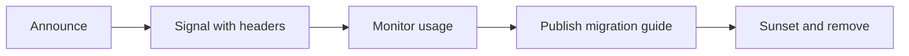

## In a nutshell

Sometimes you need to remove or replace part of your API, but people are already using it. Deprecation is the process of giving them advance warning, providing a migration path to the replacement, and setting a clear deadline before the old version goes away. Done well, nobody's app breaks. Done poorly (or not at all), you get angry developers and emergency rollbacks.

## The situation

Your payments API has an endpoint that returns amounts as floats: `"amount": 49.99`. You've learned the hard way that floats cause rounding errors, and the correct approach is integer cents: `"amount_cents": 4999`. You want to fix it.

But 200 integrations depend on the `amount` field. You can't just remove it. You can't change its meaning. And if you do nothing, every new consumer inherits a footgun.

This is the deprecation problem: how do you evolve an API without breaking the people who depend on it?

## Additive vs breaking changes

The single most important rule of API evolution: **additive changes are safe, subtractive changes break things.**

| Change type | Safe? | Example |
|---|---|---|
| Add a new field to the response | Yes | Adding `amount_cents` alongside existing `amount` |
| Add a new optional query parameter | Yes | Adding `?include=line_items` |
| Add a new endpoint | Yes | Adding `POST /v1/invoices/{id}/finalize` |
| Add a new enum value | Maybe | Adding `"refunded"` to `status` — safe if consumers handle unknowns |
| Remove a field from the response | **No** | Removing `amount` — consumers parsing it will break |
| Rename a field | **No** | Renaming `email` to `email_address` — same as remove + add |
| Change a field's type | **No** | Changing `amount` from float to integer |
| Make an optional field required | **No** | Old requests without the field will now fail |
| Remove an endpoint | **No** | Consumers calling it will get 404 |

<Callout type="aha" title="The golden rule">
  <p>You can always add. You can never remove. This is why API design decisions are so important upfront — every field you add is a field you're committing to support. The deprecation process exists for the rare cases when you genuinely need to take something away.</p>
</Callout>

## The deprecation lifecycle

Deprecation isn't flipping a switch. It's a communication process with concrete steps and a timeline that gives consumers enough time to adapt.

Here's the full lifecycle at a glance:



### Phase 1: Announce (T-0)

Mark the field or endpoint as deprecated in your spec and documentation. Start returning deprecation headers in responses.

```yaml
# OpenAPI spec — mark the field as deprecated
components:
  schemas:
    Payment:
      type: object
      properties:
        amount:
          type: number
          deprecated: true
          description: >
            DEPRECATED — Use amount_cents instead.
            This field will be removed on 2026-10-01.
        amount_cents:
          type: integer
          description: Amount in smallest currency unit (e.g., cents for USD)
```

### Phase 2: Signal in responses (T-0 onward)

Add standard HTTP deprecation headers to every response from the deprecated endpoint or containing the deprecated field:

```text
HTTP/1.1 200 OK
Content-Type: application/json
Deprecation: Sun, 13 Apr 2026 00:00:00 GMT
Sunset: Wed, 01 Oct 2026 00:00:00 GMT
Link: <https://docs.example.com/migrations/amount-to-cents>; rel="deprecation"
```

```json
{
  "id": "pay_x7k9",
  "amount": 49.99,
  "amount_cents": 4999,
  "currency": "usd",
  "status": "succeeded",
  "_deprecations": [
    {
      "field": "amount",
      "message": "Use amount_cents instead. This field will be removed on 2026-10-01.",
      "migration_guide": "https://docs.example.com/migrations/amount-to-cents",
      "sunset_date": "2026-10-01"
    }
  ]
}
```

The `Deprecation` header (RFC 9745) signals when the deprecation was announced. The `Sunset` header (RFC 8594) signals when the resource or field will be removed. The `Link` header points consumers to the migration guide.

### Phase 3: Monitor and notify (T+30 days)

Track which API keys are still using the deprecated field. Reach out directly.

```json
{
  "deprecated_field_usage": {
    "field": "amount",
    "period": "2026-04-13 to 2026-05-13",
    "total_requests": 142857,
    "unique_api_keys": 23,
    "top_consumers": [
      { "api_key": "sk_...a1b2", "requests": 89400, "contact": "billing@acme.com" },
      { "api_key": "sk_...c3d4", "requests": 31200, "contact": "dev@initech.com" },
      { "api_key": "sk_...e5f6", "requests": 12100, "contact": "api@globex.com" }
    ]
  }
}
```

<Callout type="tip" title="Don't deprecate silently">
  <p>Headers are machine-readable, but humans need emails. When you deprecate something, send direct communication to every API key that has used the deprecated feature in the last 90 days. Include the sunset date, the migration guide, and a concrete code example showing the old way and the new way.</p>
</Callout>

### Phase 4: Migration guide

The migration guide is the most important artifact in the deprecation process. It must be concrete — not "use the new field" but "change this line of code":

**Before:**

```typescript
const total = payment.amount; // Returns 49.99 (float — may cause rounding errors)
const display = `$${total.toFixed(2)}`;
```

**After:**

```typescript
const totalCents = payment.amount_cents; // Returns 4999 (integer — precise)
const display = `$${(totalCents / 100).toFixed(2)}`;
```

### Phase 5: Sunset (T+6 months)

On the sunset date, remove the deprecated feature. Return a clear error for anyone still using it:

```json
{
  "error": {
    "type": "gone",
    "message": "The 'amount' field was removed on 2026-10-01. Use 'amount_cents' instead.",
    "code": "deprecated_field_removed",
    "migration_guide": "https://docs.example.com/migrations/amount-to-cents"
  }
}
```

## The deprecation timeline

```text
Apr 2026          May              Jul              Oct 2026
    │               │                │                │
    ▼               ▼                ▼                ▼
 Announce       First email      Reminder         Sunset
 ─────────────────────────────────────────────────────────
 • Deprecation   • Usage report   • "30 days       • Field removed
   header added  • Direct email     remaining"     • 410 Gone for
 • New field       to top         • Final             old field
   available       consumers        notification
 • Docs updated
 • Spec marked
   deprecated
```

## API changelog

Every API change — especially deprecations — should be tracked in a changelog. Consumers need a single place to see what changed and when:

```json
{
  "changelog": [
    {
      "date": "2026-04-13",
      "type": "deprecated",
      "description": "Payment.amount field deprecated in favor of Payment.amount_cents",
      "sunset_date": "2026-10-01",
      "migration_guide": "https://docs.example.com/migrations/amount-to-cents",
      "affected_endpoints": [
        "GET /v1/payments/:id",
        "GET /v1/payments",
        "POST /v1/payments"
      ]
    },
    {
      "date": "2026-04-01",
      "type": "added",
      "description": "Added amount_cents field to Payment object",
      "affected_endpoints": [
        "GET /v1/payments/:id",
        "GET /v1/payments",
        "POST /v1/payments"
      ]
    },
    {
      "date": "2026-03-15",
      "type": "added",
      "description": "Added POST /v1/invoices/:id/finalize endpoint",
      "affected_endpoints": ["POST /v1/invoices/:id/finalize"]
    }
  ]
}
```

<Callout type="warning" title="Minimum deprecation runway">
  <p>For public APIs, 6 months is the minimum reasonable sunset window. For partner APIs, 3 months. For internal APIs, at least 1 sprint. Anything shorter and you're not deprecating — you're just breaking things with advance notice. Stripe gives 2+ years for major deprecations. That's why developers trust them.</p>
</Callout>

## Checklist: deprecation done right

- [ ] New replacement is available before the old feature is deprecated
- [ ] `Deprecation` and `Sunset` headers added to affected responses
- [ ] OpenAPI spec updated with `deprecated: true` and a description
- [ ] Migration guide published with before/after code examples
- [ ] Direct email to consumers using the deprecated feature
- [ ] Usage monitoring to track migration progress
- [ ] Reminder at 30 days before sunset
- [ ] Changelog entry with dates, affected endpoints, and links
- [ ] On sunset: clear error message with a link to the migration guide

---

*You've reached the end of the Lifecycle section. Every tool and practice here — docs, SDKs, contract tests, linting, deprecation — exists for one reason: to make your API a product that developers trust, adopt, and stick with. Next up: what changes when your API consumer isn't a human developer, but an AI agent.*
