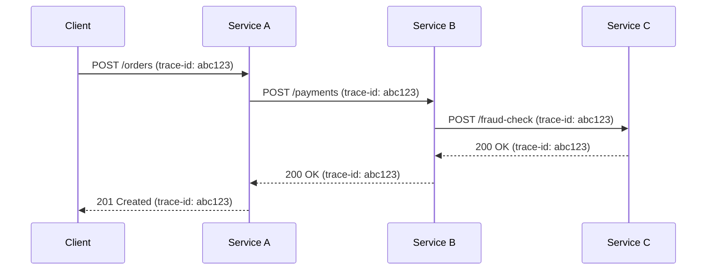

## In a nutshell

When a request passes through multiple services before returning a response, figuring out which service caused a problem is nearly impossible from logs alone. Distributed tracing assigns a unique ID to each request and passes it through every service in the chain, building a timeline that shows exactly where time was spent and where things went wrong.

## The situation

A user reports that checkout is slow. You check the API gateway — it returned a 200 in 3.2 seconds. But which of the 12 downstream services caused the delay? Was it the payment service? The inventory check? The tax calculator? The fraud detection engine?

You check each service's logs individually. You find hundreds of requests happening at the same time. You can't tell which log entries belong to the user's request and which belong to someone else's.

Without tracing, debugging a distributed system is like reading 12 books at the same time with all the pages shuffled together.

## What a trace actually is

A **trace** represents the entire journey of a single request through your system. It's made up of **spans** — one span per operation. Each span knows its parent, creating a tree that shows exactly what happened, where, and how long it took.

```
Trace: 4bf92f3577b34da6a3ce929d0e0e4736

[API Gateway]──────────────────────────── 3200ms
  [Order Service]────────────────────── 3180ms
    [Payment Service]──────────────── 2800ms
      [Fraud Check]──────────── 2400ms  <-- here's your problem
      [Card Processing]──── 350ms
    [Inventory Service]──── 120ms
    [Notification Service]── 45ms
```

One glance. The fraud check took 2.4 seconds. That's your bottleneck. No log correlation, no guessing, no asking three teams what happened.

Here's how a trace-id propagates across services, connecting every hop into a single trace:



## Trace propagation: the W3C Trace Context

For tracing to work across services, every service needs to pass the trace context to the next one. The industry standard is [W3C Trace Context](https://www.w3.org/TR/trace-context/), which uses a single HTTP header:

```
traceparent: 00-4bf92f3577b34da6a3ce929d0e0e4736-00f067aa0ba902b7-01
```

That header packs four fields into one string:

| Field | Value | Meaning |
|---|---|---|
| `version` | `00` | Format version (always `00` today) |
| `trace-id` | `4bf92f3577b34da6...` | 32-hex-char ID for the entire trace |
| `parent-id` | `00f067aa0ba902b7` | 16-hex-char ID for the current span |
| `trace-flags` | `01` | `01` = sampled (recorded), `00` = not sampled |

When Service A calls Service B, it sends this header. Service B reads the `trace-id` (same for the whole trace), uses the `parent-id` to link back to Service A's span, generates a new `parent-id` for its own span, and passes the updated header to Service C.

```bash
# Service A calls Service B
curl -X POST https://payment-service/api/charge \
  -H "traceparent: 00-4bf92f3577b34da6a3ce929d0e0e4736-00f067aa0ba902b7-01" \
  -H "Content-Type: application/json" \
  -d '{"order_id": "ord_x7k9", "amount": 49.98}'
```

<Callout type="aha" title="The propagation rule">
  <p>Every HTTP call between services must forward the <code>traceparent</code> header. If even one service drops it, the trace breaks in half and you lose visibility into everything downstream. This is why tracing is a system-wide concern, not a per-service feature.</p>
</Callout>

## Anatomy of a span

Each span in a trace captures one unit of work. Here's what a span looks like in OpenTelemetry format:

```json
{
  "traceId": "4bf92f3577b34da6a3ce929d0e0e4736",
  "spanId": "6e0c63257de34c92",
  "parentSpanId": "00f067aa0ba902b7",
  "name": "POST /api/charge",
  "kind": "SERVER",
  "startTimeUnixNano": 1744551127000000000,
  "endTimeUnixNano": 1744551129800000000,
  "attributes": {
    "http.method": "POST",
    "http.url": "/api/charge",
    "http.status_code": 200,
    "service.name": "payment-service",
    "payment.provider": "stripe",
    "payment.amount": 49.98
  },
  "status": {
    "code": "OK"
  },
  "events": [
    {
      "name": "fraud_check_started",
      "timeUnixNano": 1744551127100000000
    },
    {
      "name": "fraud_check_completed",
      "timeUnixNano": 1744551129500000000,
      "attributes": {
        "fraud.risk_score": 0.12,
        "fraud.decision": "approve"
      }
    }
  ]
}
```

Key fields:

- **traceId** — same across all spans in this trace. This is the correlation key.
- **spanId** — unique to this specific operation.
- **parentSpanId** — links this span to whoever called it. This builds the tree.
- **attributes** — arbitrary key-value pairs you add for debugging context.
- **events** — timestamped markers within the span for sub-operations.

## A trace across three services

Here's how a complete trace looks when a user places an order. Three services, four spans:

```json
[
  {
    "traceId": "4bf92f3577b34da6a3ce929d0e0e4736",
    "spanId": "00f067aa0ba902b7",
    "parentSpanId": null,
    "name": "POST /api/orders",
    "service": "api-gateway",
    "duration_ms": 3200,
    "status_code": 201
  },
  {
    "traceId": "4bf92f3577b34da6a3ce929d0e0e4736",
    "spanId": "a1b2c3d4e5f60718",
    "parentSpanId": "00f067aa0ba902b7",
    "name": "process_order",
    "service": "order-service",
    "duration_ms": 3180,
    "status_code": 201
  },
  {
    "traceId": "4bf92f3577b34da6a3ce929d0e0e4736",
    "spanId": "6e0c63257de34c92",
    "parentSpanId": "a1b2c3d4e5f60718",
    "name": "POST /api/charge",
    "service": "payment-service",
    "duration_ms": 2800,
    "status_code": 200
  },
  {
    "traceId": "4bf92f3577b34da6a3ce929d0e0e4736",
    "spanId": "b7c8d9e0f1a23456",
    "parentSpanId": "a1b2c3d4e5f60718",
    "name": "POST /api/reserve",
    "service": "inventory-service",
    "duration_ms": 120,
    "status_code": 200
  }
]
```

Follow the `parentSpanId` links: the gateway spawns the order service, which spawns payment and inventory in parallel. The payment service took 2800ms out of a total 3200ms. That's your investigation starting point.

## Baggage: passing context, not just IDs

Sometimes you need more than trace and span IDs. You need to pass arbitrary context through the entire request chain — a user ID, a feature flag, a tenant identifier, an A/B test cohort.

That's what **baggage** is for. It's a separate W3C header:

```
baggage: userId=usr_8a3f,tenantId=acme-corp,abTest=checkout-v2
```

Every service in the chain can read and add to the baggage. But use it sparingly — baggage travels with every request to every downstream service. Large baggage creates overhead and potential data leakage.

<Callout type="warning" title="Baggage is not free">
  <p>Baggage propagates to every downstream service, including third-party ones. Never put sensitive data (tokens, PII, secrets) in baggage. And keep the total size small — some proxies and load balancers truncate headers beyond 8KB.</p>
</Callout>

## Sampling: you can't trace everything

In production, tracing every request is expensive — each span is a data point that needs to be collected, stored, and indexed. At high throughput, that adds up fast.

Sampling strategies:

| Strategy | How it works | Good for |
|---|---|---|
| **Head-based** | Decide at the start: sample 10% of traces | Simple, predictable cost |
| **Tail-based** | Decide after the trace completes: keep errors and slow traces | Better signal, higher infra cost |
| **Always-on for errors** | Sample normally, but keep 100% of failed traces | Never miss an incident |

<Callout type="tip" title="The practical sampling setup">
  <p>Start with head-based sampling at 10-20%. Add a rule to always keep traces where any span has an error status or latency above your SLO threshold. This gives you cost control without losing the traces you actually need to debug.</p>
</Callout>

## Checklist: tracing readiness

- [ ] All services propagate the `traceparent` header on outbound HTTP calls
- [ ] Trace IDs appear in your structured logs (so you can cross-reference)
- [ ] You can search for a trace by ID and see the full span tree
- [ ] Spans include meaningful attributes (endpoint, status, user ID)
- [ ] Sampling is configured — you're not storing 100% or 0%
- [ ] Error and high-latency traces are always retained

---

*Next up: health checks and readiness probes — because "the service is running" doesn't mean "the service is ready."*
