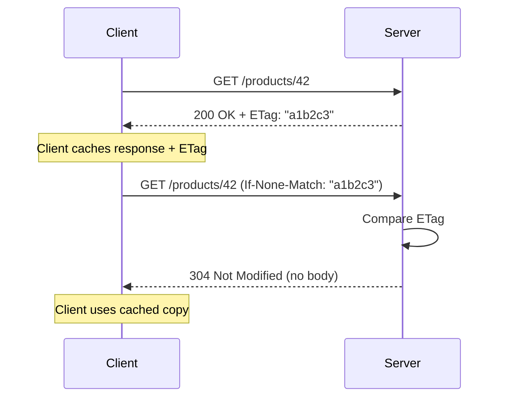

## In a nutshell

Caching stores the result of an API call so that the next identical request can be answered instantly without doing the work again. HTTP has built-in caching mechanisms -- headers like `Cache-Control` and `ETag` -- that let your API tell browsers, CDNs, and clients how long a response stays valid and how to check whether it's changed. Used well, caching can eliminate the vast majority of redundant requests and make your API dramatically faster.

## The situation

Your product catalog endpoint handles 50,000 requests per minute. Your database is sweating. You add more replicas, bump the connection pool, optimize queries. Response times improve from 300ms to 200ms.

Then someone points out that the catalog only changes twice a day. 49,998 of those 50,000 requests per minute are returning identical data. Your database is doing the same work 50,000 times for data that changed at 9am and 3pm.

The fastest API call is the one that never hits your server.

## Cache-Control: telling clients what to cache

The `Cache-Control` header is how your API tells clients and intermediaries (CDNs, proxies) how to handle caching:

```http
HTTP/1.1 200 OK
Content-Type: application/json
Cache-Control: public, max-age=3600

{
  "products": [
    { "id": "prod_1", "name": "Widget A", "price": 29.99 },
    { "id": "prod_2", "name": "Widget B", "price": 49.99 }
  ]
}
```

This response says: "this data is public, and it's valid for 3,600 seconds (1 hour). Don't ask me again until then."

### The directives that matter

| Directive | What it means |
|-----------|---------------|
| `public` | Any cache can store this (CDNs, proxies, browsers) |
| `private` | Only the end user's browser can cache this (not shared caches) |
| `max-age=N` | The response is fresh for N seconds |
| `no-cache` | You CAN cache it, but you MUST revalidate with the server before using it |
| `no-store` | Do NOT cache this. At all. Ever. |
| `must-revalidate` | Once stale, you MUST revalidate — don't use stale data even if the server is down |
| `stale-while-revalidate=N` | Serve stale data for up to N seconds while fetching a fresh copy in the background |

<Callout type="warning" title="no-cache does NOT mean no caching">
  <p><code>no-cache</code> means "cache it, but always check with the server first." If you want to prevent caching entirely, use <code>no-store</code>. This naming confusion has caused countless bugs.</p>
</Callout>

### Common patterns

**Public catalog data** — changes infrequently, same for all users:

```http
Cache-Control: public, max-age=3600, stale-while-revalidate=86400
```

Cache for 1 hour. After that, serve stale data for up to 24 hours while revalidating in the background.

**User-specific data** — different for each user, changes often:

```http
Cache-Control: private, max-age=60
```

Only the user's browser caches this, and only for 60 seconds.

**Sensitive data** — authentication tokens, financial data:

```http
Cache-Control: no-store
```

Never cache. Not in the browser, not in a proxy, not anywhere.

**Data that must always be fresh** — stock prices, inventory counts:

```http
Cache-Control: no-cache
```

Cache it, but always ask the server "is this still valid?" before using it. This is where ETags come in.

## ETags: validating cached data

An **ETag** (entity tag) is a fingerprint of a response. The server generates it, the client stores it, and on the next request the client asks "has this changed?"

Here's the conditional request flow with ETags:



### The flow

**Step 1: Server returns data with an ETag**

```http
GET /v1/products/prod_1 HTTP/1.1
Host: api.example.com
```

```http
HTTP/1.1 200 OK
Content-Type: application/json
ETag: "a1b2c3d4e5"
Cache-Control: no-cache

{
  "id": "prod_1",
  "name": "Widget A",
  "price": 29.99,
  "updated_at": "2026-04-13T10:00:00Z"
}
```

**Step 2: Client makes a conditional request with If-None-Match**

```http
GET /v1/products/prod_1 HTTP/1.1
Host: api.example.com
If-None-Match: "a1b2c3d4e5"
```

**Step 3a: Data hasn't changed — server returns 304 with no body**

```http
HTTP/1.1 304 Not Modified
ETag: "a1b2c3d4e5"
Cache-Control: no-cache
```

No response body. No serialization. No bandwidth. The client uses its cached copy. The server might still hit the database to check the ETag, but it skips the expensive part: serializing and transmitting the payload.

**Step 3b: Data has changed — server returns the new version**

```http
HTTP/1.1 200 OK
Content-Type: application/json
ETag: "f6g7h8i9j0"
Cache-Control: no-cache

{
  "id": "prod_1",
  "name": "Widget A",
  "price": 34.99,
  "updated_at": "2026-04-13T14:30:00Z"
}
```

New ETag, new data. The client updates its cache.

<Callout type="aha" title="ETags save bandwidth, not always DB queries">
  <p>A 304 response saves the client bandwidth and latency, but the server still needs to compute the ETag to compare it. The real win is on large payloads — a 500KB product listing reduced to a 0-byte 304 response.</p>
</Callout>

### Generating ETags

ETags can be **strong** or **weak**:

- **Strong ETag**: `"a1b2c3d4e5"` — byte-for-byte identical
- **Weak ETag**: `W/"a1b2c3d4e5"` — semantically equivalent (allows minor formatting differences)

Common generation strategies:

```
Hash of the response body:     ETag: "sha256:abc123..."
Database row version:          ETag: "v42"
Last-modified timestamp:       ETag: "1712847600"
```

For APIs, a hash of the JSON response body or the database `updated_at` timestamp both work well.

## Stale-while-revalidate

This is the best directive most APIs aren't using. It lets caches serve stale data immediately while fetching fresh data in the background:

```http
Cache-Control: public, max-age=60, stale-while-revalidate=300
```

This means:

```
t=0s     Fresh response cached
t=0-60s  Serve from cache (fresh)
t=60s    Cache is stale, but serve it anyway while revalidating
t=60-360s Serve stale data, background revalidation happening
t=360s+  Stale window expired — must wait for fresh data
```

The user always gets an instant response. The data might be up to 5 minutes old during revalidation, but for most API data, that's perfectly acceptable.

<Callout type="tip" title="Ideal for read-heavy APIs">
  <p>If your data changes infrequently and slight staleness is acceptable (product catalogs, user profiles, configuration), <code>stale-while-revalidate</code> gives you both speed and eventual freshness.</p>
</Callout>

## Cache layers

API caching happens at multiple layers, and you should think about each one:

| Layer | Controlled by | Example |
|-------|--------------|---------|
| Client cache | `Cache-Control` headers | Browser, mobile app, HTTP client library |
| CDN / reverse proxy | `Cache-Control` + `Vary` headers | Cloudflare, Fastly, Nginx |
| API gateway cache | Gateway configuration | Kong, AWS API Gateway |
| Application cache | Your code | Redis, Memcached |
| Database cache | Query optimizer | PostgreSQL buffer cache, query result cache |

```http
GET /v1/products HTTP/1.1
Host: api.example.com

→ CDN cache hit? → Return cached response (< 10ms)
→ CDN miss → API gateway cache hit? → Return cached (< 50ms)
→ Gateway miss → Application Redis cache hit? → Return cached (< 100ms)
→ Redis miss → Database query → Cache result → Return (< 300ms)
```

### The Vary header

When caching at shared layers (CDN, proxy), you need to tell the cache which request headers affect the response:

```http
HTTP/1.1 200 OK
Cache-Control: public, max-age=3600
Vary: Accept-Language, Authorization
```

This tells the CDN: "a request with `Accept-Language: en` and one with `Accept-Language: fr` are different cache entries." Without `Vary`, a French user might get the cached English response.

## When NOT to cache

Not everything should be cached:

- **Write operations** — POST, PUT, PATCH, DELETE responses
- **User-specific sensitive data** — unless with `private` and short `max-age`
- **Real-time data** — stock tickers, live scores, chat messages
- **Non-deterministic responses** — search results with personalization, randomized content

## Checklist: caching strategy

- [ ] Set `Cache-Control` headers on every GET endpoint
- [ ] Use `public` for shared data, `private` for user-specific data, `no-store` for sensitive data
- [ ] Implement ETags for endpoints where conditional requests save bandwidth
- [ ] Use `stale-while-revalidate` for read-heavy endpoints that tolerate slight staleness
- [ ] Set `Vary` headers when responses differ by request headers (language, auth, content type)
- [ ] Add an application-level cache (Redis) for expensive queries
- [ ] Monitor cache hit rates — low hit rates mean your cache config needs tuning

---

*Next up: timeouts and deadline propagation — because even cached responses can't help when a downstream call hangs forever.*
