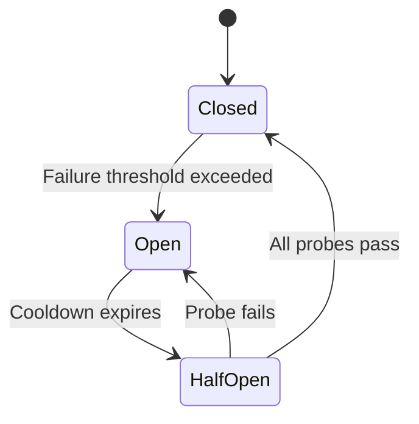
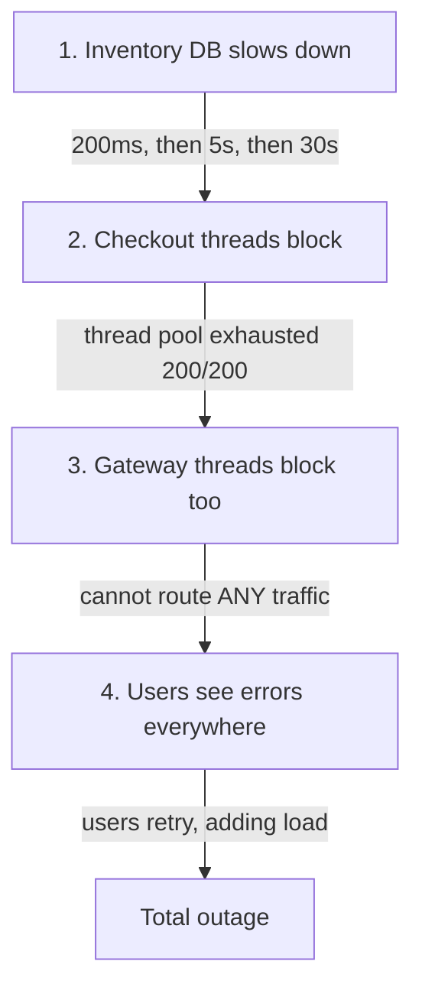
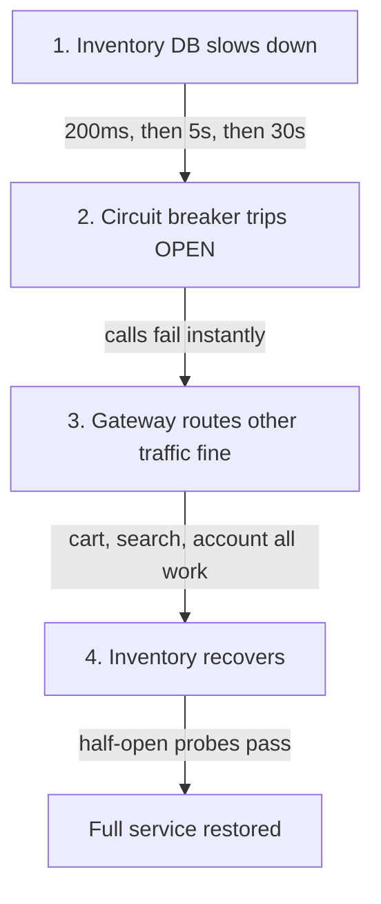

## In a nutshell

When a service your API depends on stops responding, your API can get stuck waiting and eventually go down too. A circuit breaker monitors those downstream calls and, when failures pile up, stops making them entirely -- returning an error immediately instead of waiting 30 seconds for a timeout. Once the struggling service recovers, the circuit breaker lets traffic flow again.

## The situation

Your checkout service calls the inventory service to reserve stock. The inventory service's database is overloaded — every request takes 30 seconds and then times out.

Your checkout service has 200 request threads. Each one is stuck waiting on inventory. Within a minute, all 200 threads are consumed. The checkout service can't handle any requests — not even the ones that don't need inventory. Cart browsing, order history, account pages — everything is down.

The inventory service took down the checkout service. And checkout is about to take down the API gateway. This is a **cascading failure**, and it's the most common way a microservices architecture collapses.

## What a circuit breaker does

A circuit breaker sits between your service and a dependency. It monitors failures and, when the failure rate crosses a threshold, it **stops making calls entirely** — failing immediately instead of waiting for a timeout.

The concept comes from electrical engineering. When the current exceeds safe levels, the breaker trips to prevent a fire. Same idea: when error rates exceed safe levels, stop sending traffic to prevent a system-wide outage.

## The three states

A circuit breaker has three states, and the transitions between them are the key to understanding the pattern:

### Closed (normal operation)

All requests pass through to the dependency. The breaker tracks success and failure counts.

```http
POST /internal/inventory/reserve HTTP/1.1
Host: inventory-service
Content-Type: application/json

{
  "sku": "WIDGET-001",
  "quantity": 2
}
```

```http
HTTP/1.1 200 OK
Content-Type: application/json

{
  "reservation_id": "res_abc123",
  "sku": "WIDGET-001",
  "quantity": 2,
  "expires_at": "2026-04-13T16:00:00Z"
}
```

The breaker sees: success. Counter stays healthy.

### Open (failing fast)

The failure threshold has been crossed. The breaker **rejects all requests immediately** without calling the dependency. This is the protective state.

```http
POST /internal/inventory/reserve HTTP/1.1
Host: inventory-service
Content-Type: application/json

{
  "sku": "WIDGET-001",
  "quantity": 2
}
```

The request never leaves your service. The circuit breaker returns an error immediately:

```http
HTTP/1.1 503 Service Unavailable
Content-Type: application/json

{
  "error": {
    "code": "circuit_open",
    "message": "Inventory service is currently unavailable",
    "retry_after": 30
  }
}
```

Response time: 1 millisecond instead of 30 seconds. Your threads are free. Your service stays alive.

### Half-open (testing recovery)

After a cooldown period, the breaker allows a **limited number of probe requests** through to test if the dependency has recovered.

- If the probe succeeds, the breaker transitions back to **closed**
- If the probe fails, the breaker returns to **open** and resets the cooldown timer



<Callout type="aha" title="Why half-open matters">
  <p>Without the half-open state, you'd need to manually reset the breaker or wait for a fixed timer. Half-open automates recovery detection: the breaker heals itself when the dependency comes back, and re-trips if it hasn't.</p>
</Callout>

## What happens without a circuit breaker

Here's the cascading failure in detail:



With a circuit breaker on the checkout → inventory call:



## Configuration thresholds

A circuit breaker needs three main configuration values:

| Parameter | What it controls | Typical value |
|-----------|-----------------|---------------|
| Failure threshold | How many failures before tripping | 5 failures in 10 seconds, or 50% failure rate |
| Cooldown period | How long to stay open before testing | 30-60 seconds |
| Probe count | How many test requests in half-open | 1-3 requests |

```typescript
const circuitBreakerConfig = {
  // Trip after 5 failures in a 10-second window
  failureThreshold: 5,
  failureWindowMs: 10_000,

  // Wait 30 seconds before probing
  cooldownMs: 30_000,

  // Allow 3 probe requests in half-open state
  probeCount: 3,

  // Only count these as failures (not 400s)
  failureStatusCodes: [500, 502, 503, 504],

  // Timeouts count as failures
  timeoutMs: 5_000,
};
```

<Callout type="warning" title="Tune your thresholds">
  <p>A threshold that's too low trips on normal transient errors. A threshold that's too high lets the cascading failure happen before the breaker kicks in. Start with a 50% failure rate over a 10-second window and adjust based on your traffic patterns.</p>
</Callout>

## Fallback strategies

When the circuit is open, you need to decide what to return. Options:

1. **Return an error** — honest and simple, let the caller handle it
2. **Return cached data** — stale data is better than no data for read operations
3. **Return a default** — "inventory unknown" instead of crashing the checkout flow
4. **Degrade gracefully** — skip the optional feature (e.g., show products without stock counts)

```typescript
async function getInventory(sku: string): Promise<InventoryResult> {
  try {
    return await circuitBreaker.call(() =>
      fetch(`/internal/inventory/${sku}`)
    );
  } catch (error) {
    if (error instanceof CircuitOpenError) {
      // Fallback: return cached data or a degraded response
      const cached = await cache.get(`inventory:${sku}`);
      if (cached) return { ...cached, source: "cache", stale: true };

      return { sku, available: null, source: "fallback" };
    }
    throw error;
  }
}
```

## Health check integration

Your health endpoint should reflect circuit breaker states so load balancers and monitoring can act:

```http
GET /health HTTP/1.1
Host: checkout-service
```

```json
{
  "status": "degraded",
  "checks": {
    "database": { "status": "healthy", "latency_ms": 12 },
    "inventory-service": {
      "status": "unhealthy",
      "circuit": "open",
      "last_failure": "2026-04-13T14:32:10Z",
      "cooldown_remaining_s": 22
    },
    "payment-service": { "status": "healthy", "latency_ms": 85 }
  }
}
```

This gives your operations team immediate visibility into which dependencies are struggling without digging through logs.

## Checklist: circuit breaker implementation

- [ ] Identify all external dependencies that could fail or slow down
- [ ] Add circuit breakers on each outbound call
- [ ] Configure failure thresholds based on your traffic patterns
- [ ] Implement a fallback strategy for each dependency (error, cache, default, or degrade)
- [ ] Expose circuit breaker state in your health endpoint
- [ ] Set up alerts for circuit state changes (closed → open)
- [ ] Test by injecting failures — your breaker should trip and recover cleanly

---

*Next up: rate limiting — protecting your API not from failing dependencies, but from being overwhelmed by your own consumers.*
