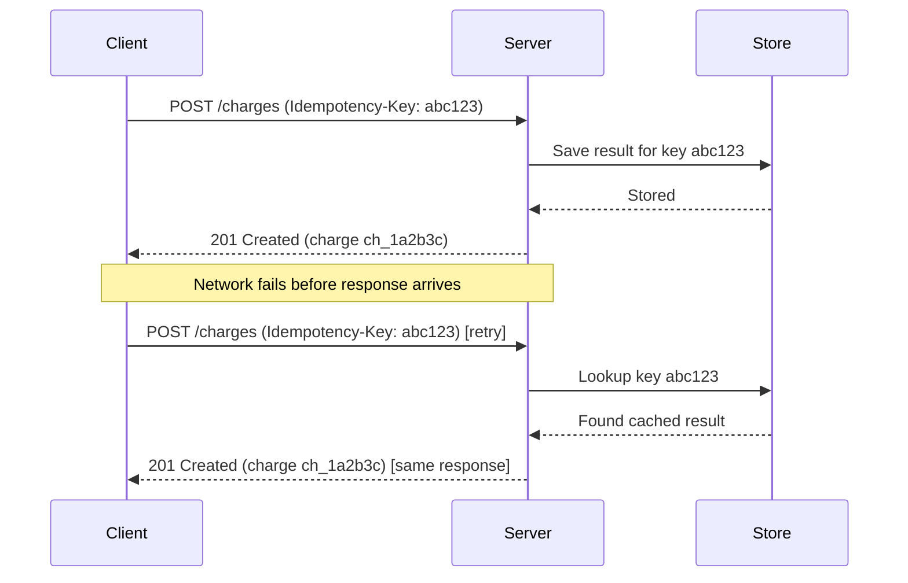

## In a nutshell

If you send the same request twice, does it produce the same result or does it create a mess? Idempotency means designing your API so that duplicate requests are safe -- the server recognizes it already processed this request and returns the same result instead of doing the work again. This matters most for operations like payments, where a network glitch and an automatic retry could otherwise charge a customer twice.

## The situation

Your payment service processes a charge. The response is slow — the client times out after 10 seconds. The user clicks "Pay" again. Or worse, your retry logic kicks in automatically.

The server received both requests. It processed both. The customer just got charged twice.

This isn't an edge case. It's what happens when you build APIs without thinking about idempotency.

## What idempotency actually means

An operation is **idempotent** if performing it multiple times produces the same result as performing it once. Not the same response — the same *effect* on the system.

Some HTTP methods are **naturally idempotent** by specification:

| Method | Idempotent? | Why |
|--------|-------------|-----|
| GET | Yes | Reading data doesn't change state |
| PUT | Yes | Replacing a resource with the same data produces the same state |
| DELETE | Yes | Deleting something that's already deleted is a no-op |
| PATCH | It depends | Depends on the operation (increment vs set) |
| POST | No | Each call typically creates a new resource or triggers a new side effect |

POST is the problem child. Every call creates a new order, triggers a new payment, sends a new email. And POST is exactly the method you use for the operations where duplication hurts the most.

<Callout type="aha" title="The key distinction">
  <p>GET, PUT, and DELETE are safe to retry by design. POST is not — and POST is what you use for payments, orders, transfers, and every other operation where a duplicate would be catastrophic.</p>
</Callout>

Here's how idempotency keys prevent duplicate charges when retries happen:



## The double-charge problem

Here's what happens without idempotency protection:

```http
POST /v1/charges HTTP/1.1
Host: api.payments.com
Content-Type: application/json

{
  "amount": 4999,
  "currency": "usd",
  "customer_id": "cus_abc123",
  "description": "Pro plan subscription"
}
```

```http
HTTP/1.1 201 Created
Content-Type: application/json

{
  "id": "ch_1a2b3c",
  "amount": 4999,
  "currency": "usd",
  "status": "succeeded"
}
```

The client never sees this response — the connection dropped. It retries the same request. The server has no way to know this is a retry. It creates a second charge:

```http
HTTP/1.1 201 Created
Content-Type: application/json

{
  "id": "ch_4d5e6f",
  "amount": 4999,
  "currency": "usd",
  "status": "succeeded"
}
```

Two charges. One angry customer.

## The idempotency key pattern

The fix is simple: the client sends a unique key with the request. The server uses that key to detect duplicates.

```http
POST /v1/charges HTTP/1.1
Host: api.payments.com
Content-Type: application/json
Idempotency-Key: order_7f3a9c_charge_2024

{
  "amount": 4999,
  "currency": "usd",
  "customer_id": "cus_abc123",
  "description": "Pro plan subscription"
}
```

**First call** — the server processes the charge, stores the result keyed by `order_7f3a9c_charge_2024`, and returns:

```http
HTTP/1.1 201 Created
Content-Type: application/json

{
  "id": "ch_1a2b3c",
  "amount": 4999,
  "currency": "usd",
  "status": "succeeded"
}
```

**Second call (retry)** — same `Idempotency-Key`. The server finds the stored result and replays it:

```http
HTTP/1.1 201 Created
Content-Type: application/json

{
  "id": "ch_1a2b3c",
  "amount": 4999,
  "currency": "usd",
  "status": "succeeded"
}
```

Same response. Same charge ID. No duplicate. The client can retry as many times as it needs to.

### How Stripe implements this

Stripe's idempotency implementation is the gold standard. Here's how it works:

1. **Client generates a UUID** (or any unique string) and sends it as the `Idempotency-Key` header
2. **Server checks** if a result already exists for that key
3. **If no result exists** — process the request, store the result with the key, return the response
4. **If a result exists** — return the stored response without reprocessing
5. **Keys expire** after 24 hours — old enough that any retry storm is long over

```http
POST /v1/charges HTTP/1.1
Idempotency-Key: 8a3b1f2e-4c5d-6e7f-8a9b-0c1d2e3f4a5b
Content-Type: application/json

{
  "amount": 2000,
  "currency": "eur",
  "source": "tok_visa"
}
```

If you send the same key with **different parameters**, Stripe returns a `400` error — the key is locked to the original request body. This prevents a subtle class of bugs where a client accidentally reuses a key for a different operation.

```http
HTTP/1.1 400 Bad Request
Content-Type: application/json

{
  "error": {
    "type": "idempotency_error",
    "message": "Keys for idempotent requests can only be used with the same parameters they were first used with."
  }
}
```

<Callout type="tip" title="Key generation advice">
  <p>Use a UUID v4 for simple cases. For business operations, use a deterministic key that ties to the business action — like <code>order_&#123;orderId&#125;_charge</code>. Deterministic keys survive client crashes: if the client restarts and retries, it generates the same key and gets the stored response.</p>
</Callout>

## Server-side implementation

The server needs three things:

1. **A store** for idempotency keys and their responses (database, Redis, etc.)
2. **A lock** to prevent concurrent requests with the same key from racing
3. **An expiry** so old keys don't accumulate forever

The flow looks like this:

```
Request arrives with Idempotency-Key
  → Check store for key
    → Key exists? Return stored response (replay)
    → Key doesn't exist?
      → Acquire lock on key
      → Process request
      → Store response with key
      → Release lock
      → Return response
```

<Callout type="warning" title="Watch for race conditions">
  <p>If two identical requests arrive at the same millisecond, both will see "key doesn't exist" and try to process. You need a lock (database row lock, Redis SETNX, etc.) to ensure only one request processes while the other waits and then gets the stored response.</p>
</Callout>

## Naturally idempotent design

Before reaching for idempotency keys, consider whether you can make the operation naturally idempotent:

- **Use PUT instead of POST** when the client knows the resource ID: `PUT /orders/order_123` is idempotent by nature
- **Use conditional writes**: "set balance to 50" is idempotent; "add 10 to balance" is not
- **Use unique constraints**: a database unique index on `(customer_id, order_reference)` rejects duplicates at the storage layer

Idempotency keys are for when the operation is inherently non-idempotent and you can't redesign it — which is most payment and transaction APIs.

## Checklist: implementing idempotency

- [ ] Identify which endpoints need idempotency protection (any POST with side effects)
- [ ] Accept an `Idempotency-Key` header on those endpoints
- [ ] Store request results keyed by the idempotency key
- [ ] Return stored results for duplicate keys without reprocessing
- [ ] Reject mismatched parameters for an existing key
- [ ] Expire keys after a reasonable window (24-48 hours)
- [ ] Document the idempotency behavior in your API reference

---

*Next up: retry strategies — because idempotency makes retries safe, but you still need to decide when and how often to retry.*
