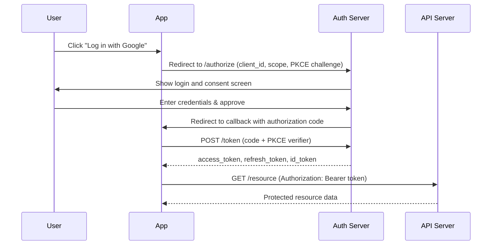

## In a nutshell

OAuth 2.0 is the protocol that lets users grant apps limited access to their data on another service -- like letting a scheduling tool read your Google Calendar -- without sharing their password. OpenID Connect adds an identity layer on top, so the app also knows *who* the user is. Together they power "Log in with Google/GitHub/etc." and most third-party API integrations.

## The situation

Your team needs to let users log in with Google and access their calendar data. Someone reads a blog post, grabs a library, and implements the Implicit flow because "it's simpler for SPAs." Six months later, a security audit flags that tokens are leaking through browser history and referrer headers. You've shipped a vulnerability that's been documented since 2019.

The flow you choose matters as much as the protocol itself.

## OAuth2 in one paragraph

OAuth2 is a **delegation protocol**. It lets a user grant a third-party application limited access to their resources on another service — without sharing their password. The user authenticates with the resource owner (e.g., Google), consents to specific scopes, and the application receives a token it can use to act on the user's behalf.

OAuth2 is about **authorization** — what can this app do? OpenID Connect (OIDC) is a layer on top that adds **authentication** — who is this user?

## The Authorization Code flow — step by step

This is the flow you should use for most applications. Here's the flow at a glance:



Here's every HTTP request involved.

**Step 1: Redirect the user to the authorization server**

```http
GET /authorize?
  response_type=code&
  client_id=app_web_abc123&
  redirect_uri=https://myapp.com/callback&
  scope=openid profile email calendar:read&
  state=xYz42Random&
  code_challenge=E9Melhoa2OwvFrEMTJguCHaoeK1t8URWbuGJSstw-cM&
  code_challenge_method=S256
HTTP/1.1
Host: accounts.google.com
```

The `state` parameter prevents CSRF. The `code_challenge` is PKCE (Proof Key for Code Exchange) — required for public clients, strongly recommended for all.

**Step 2: User authenticates and consents**

This happens in the browser, on Google's domain. Your app never sees the password.

**Step 3: Authorization server redirects back with a code**

```http
HTTP/1.1 302 Found
Location: https://myapp.com/callback?
  code=SplxlOBeZQQYbYS6WxSbIA&
  state=xYz42Random
```

The authorization code is short-lived (typically 30-60 seconds) and single-use. It's useless without the client secret and code verifier.

**Step 4: Exchange the code for tokens**

```bash
curl -X POST https://accounts.google.com/o/oauth2/token \
  -H "Content-Type: application/x-www-form-urlencoded" \
  -d "grant_type=authorization_code" \
  -d "code=SplxlOBeZQQYbYS6WxSbIA" \
  -d "redirect_uri=https://myapp.com/callback" \
  -d "client_id=app_web_abc123" \
  -d "client_secret=secret_xyz789" \
  # Confidential client (server-side). Public clients omit client_secret and rely on PKCE alone.
  -d "code_verifier=dBjftJeZ4CVP-mB92K27uhbUJU1p1r_wW1gFWFOEjXk"
```

```json
{
  "access_token": "ya29.a0AfH6SMBx...",
  "token_type": "Bearer",
  "expires_in": 3600,
  "refresh_token": "1//0gdv8rNlYEOfhCgYIARAAGBASNwF...",
  "id_token": "eyJhbGciOiJSUzI1NiIsInR5cCI6IkpXVCJ9.eyJpc3MiOiJhY2NvdW50cy5nb29nbGUuY29tIiwic3ViIjoiMTEyMjMzNDQ1NTY2Nzc4ODk5IiwiZW1haWwiOiJhbGljZUBleGFtcGxlLmNvbSIsIm5hbWUiOiJBbGljZSBKb2huc29uIiwiYXVkIjoiYXBwX3dlYl9hYmMxMjMiLCJpYXQiOjE3NDQ1Mzg0MDAsImV4cCI6MTc0NDU0MjAwMH0.signature...",
  "scope": "openid profile email calendar:read"
}
```

You get three tokens:
- **access_token** — use this to call APIs on behalf of the user
- **refresh_token** — use this to get new access tokens without re-prompting the user
- **id_token** — a JWT that tells you who the user is (this is the OIDC part)

## Decoding the id_token

The id_token is a JWT with three base64url-encoded parts separated by dots:

```json
// Header
{
  "alg": "RS256",
  "typ": "JWT",
  "kid": "google-key-2026-04"
}

// Payload
{
  "iss": "accounts.google.com",
  "sub": "112233445566778899",
  "aud": "app_web_abc123",
  "email": "alice@example.com",
  "email_verified": true,
  "name": "Alice Johnson",
  "picture": "https://lh3.googleusercontent.com/...",
  "iat": 1744538400,
  "exp": 1744542000,
  "nonce": "n-0S6_WzA2Mj"
}

// Signature
// RS256(base64url(header) + "." + base64url(payload), google_private_key)
```

**Always validate:** the signature (using the provider's public keys), the `iss` (issuer), the `aud` (your client_id), and the `exp` (expiry). Skipping any of these is a vulnerability.

<Callout type="aha" title="id_token vs access_token">
  <p>The <code>id_token</code> tells you <strong>who the user is</strong> — use it for authentication in your app. The <code>access_token</code> tells the resource server <strong>what the user allowed</strong> — use it to call third-party APIs. Never use the access_token to identify the user. Never send the id_token to a resource server.</p>
</Callout>

## Choosing the right flow

| Flow | Use case | Client type | Token delivery |
|---|---|---|---|
| **Authorization Code + PKCE** | Web apps, mobile apps, SPAs | Any | Back-channel (server-to-server) |
| **Client Credentials** | Machine-to-machine, no user involved | Confidential (servers) | Direct token response |
| **Device Authorization** | TVs, CLIs, IoT — no browser | Input-constrained | User authorizes on separate device |
| **Implicit** | **Deprecated.** Do not use. | N/A | N/A |
| **Resource Owner Password** | **Deprecated.** Do not use. | N/A | N/A |

### Client Credentials — machine-to-machine

When there's no user involved (a cron job calling an API, a service syncing data), use Client Credentials:

```bash
curl -X POST https://auth.example.com/oauth/token \
  -H "Content-Type: application/x-www-form-urlencoded" \
  -d "grant_type=client_credentials" \
  -d "client_id=service_inventory" \
  -d "client_secret=svc_secret_abc" \
  -d "scope=inventory:read inventory:write"
```

```json
{
  "access_token": "eyJhbGciOiJSUzI1NiIs...",
  "token_type": "Bearer",
  "expires_in": 3600,
  "scope": "inventory:read inventory:write"
}
```

No user authentication, no refresh token. The service authenticates directly with its own credentials.

### Device Authorization — input-constrained devices

For devices without a browser (smart TVs, CLI tools):

```bash
# Step 1: Device requests a code pair
curl -X POST https://auth.example.com/oauth/device/code \
  -d "client_id=app_tv_xyz" \
  -d "scope=profile streaming:read"
```

```json
{
  "device_code": "GmRhm...xAjK",
  "user_code": "WDJB-MJHT",
  "verification_uri": "https://auth.example.com/device",
  "expires_in": 1800,
  "interval": 5
}
```

The device displays "Go to auth.example.com/device and enter code WDJB-MJHT." The user does so on their phone. The device polls until authorization completes.

## The mistakes everyone makes

<Callout type="warning" title="Stop doing these">
  <p><strong>Storing tokens in localStorage:</strong> Any XSS vulnerability gives attackers your tokens. Use httpOnly cookies for web apps, or in-memory storage with a backend token handler.</p>
  <p><strong>Not validating the audience:</strong> If you accept any valid JWT without checking <code>aud</code>, an attacker can use a token issued for a different app to access yours.</p>
  <p><strong>Using the Implicit flow:</strong> It exposes tokens in URL fragments and browser history. Authorization Code + PKCE is the replacement. No exceptions.</p>
  <p><strong>Long-lived access tokens:</strong> Access tokens should expire in minutes (15-60), not days. Use refresh tokens for longevity.</p>
  <p><strong>Skipping the state parameter:</strong> Without <code>state</code>, your callback endpoint is vulnerable to CSRF attacks. Always generate a random state, store it in the session, and verify it on callback.</p>
</Callout>

## Using the access token

Once you have the access_token, attach it to API calls:

```bash
curl -H "Authorization: Bearer ya29.a0AfH6SMBx..." \
  https://www.googleapis.com/calendar/v3/calendars/primary/events
```

```json
{
  "kind": "calendar#events",
  "summary": "alice@example.com",
  "items": [
    {
      "id": "evt_abc123",
      "summary": "Team standup",
      "start": { "dateTime": "2026-04-14T09:00:00+02:00" },
      "end": { "dateTime": "2026-04-14T09:15:00+02:00" }
    }
  ]
}
```

If the access_token is expired, use the refresh_token to get a new one:

```bash
curl -X POST https://accounts.google.com/o/oauth2/token \
  -d "grant_type=refresh_token" \
  -d "refresh_token=1//0gdv8rNlYEOfhCgYIARAAGBASNwF..." \
  -d "client_id=app_web_abc123" \
  -d "client_secret=secret_xyz789"
```

```json
{
  "access_token": "ya29.a0NEW_TOKEN...",
  "token_type": "Bearer",
  "expires_in": 3600
}
```

<Callout type="tip" title="Refresh token rotation">
  <p>Modern OAuth servers rotate refresh tokens on every use — you get a new refresh token alongside the new access token. This limits the damage if a refresh token leaks, because it becomes single-use. Always store the latest refresh token and discard the old one.</p>
</Callout>

## Checklist: OAuth/OIDC implementation

- [ ] Am I using Authorization Code + PKCE (not Implicit)?
- [ ] Are access tokens short-lived (15-60 minutes)?
- [ ] Am I validating `iss`, `aud`, `exp`, and signature on every JWT?
- [ ] Are tokens stored securely (httpOnly cookies, not localStorage)?
- [ ] Am I using the `state` parameter for CSRF protection?
- [ ] Am I requesting only the scopes I actually need?

---

*Next up: authorization models — RBAC, ABAC, and scopes, and how to pick the right one for your API.*
